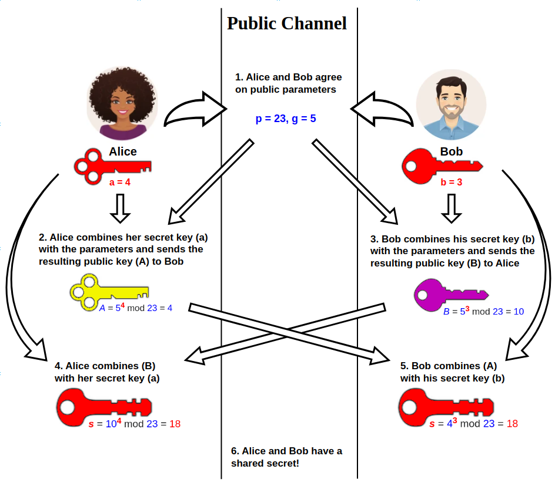

# Diffie-Hellman

**迪菲-赫尔曼密钥交换**（英语：Diffie–Hellman key exchange，缩写为D-H） 是一种安全协议。它可以让双方在完全没有对方任何预先信息的条件下通过不安全信道建立起一个密钥。这个密钥可以在后续的通讯中作为对称密钥来加密通讯内容。公钥交换的概念最早由瑞夫·墨克（Ralph C. Merkle）提出，而这个密钥交换方法，由惠特菲尔德·迪菲（Bailey Whitfield Diffie）和马丁·赫尔曼（Martin Edward Hellman）在1976年首次发表。马丁·赫尔曼曾主张这个密钥交换方法，应被称为迪菲-赫尔曼-墨克密钥交换（英语：Diffie–Hellman–Merkle key exchange）
<!-- more -->

## 概述

Diffie–Hellman（简称 **DH**）是一种经典的**密钥交换协议**，由 Whitfield Diffie 和 Martin Hellman 于 1976 年提出。它的核心目标不是直接加密消息，而是让两个此前并不共享秘密信息的通信方，能够在**公开信道**上协商出一个只有双方知道的**共享密钥**。

这件事听起来有些反直觉：通信内容和计算过程都可能被别人看到，为什么攻击者却无法得到最终的密钥？Diffie–Hellman 的巧妙之处就在于，它利用了数论中的一个难题——**离散对数问题**。在适当选择参数的前提下，攻击者虽然能看到公开交换的数据，但想从这些公开信息反推出双方的私有秘密，在计算上是极其困难的。

## 算法描述

迪菲－赫尔曼通过公共信道交换一个信息，就可以建立一个可以用于在公共信道上安全通信的共享秘密

以下解释它的过程（包括算法的数学部分）：

1. Alice 和 Bob 先协商一个大素数 **p**，并在模 p的乘法群 **G** 中选择一个生成元 **g**。(其中，**p** 和 **g** 都是公开的，攻击者也可以看到。注意，对于给定的群 G，可能存在多个生成元，Alice 和 Bob 只需选定其中一个即可)

2. Alice 选择一个随机自然数 **a** 作为私钥，计算
   $$
   A = g^a \bmod p
   $$
   并将 A 发送给 Bob。

3. Bob 选择一个随机自然数 **b** 作为私钥，计算
   $$
   B = g^b \bmod p
   $$
   并将 B 发送给 Alice。

4. Alice 收到B 后，计算
   $$
   K = B^a \bmod p = (g^b)^a \bmod p
   $$

5. Bob 收到 A 后，计算
   $$
   K = A^b \bmod p = (g^a)^b \bmod p
   $$

于是，Alice 和 Bob 都得到了同一个共享秘密：
$$
K = g^{ab} \bmod p = g^{ba} \bmod p
$$
它可以进一步经过哈希处理，导出真正用于对称加密通信的密钥。

## 安全性

在选择了合适的*G*和*g*时，这个协议被认为是窃听安全的。偷听者伊芙可能必须通过求解迪菲－赫尔曼问题来得到*g^ab*。在当前，这被认为是一个困难问题。如果出现了一个高效的解决离散对数问题的算法，那么可以用它来简化*a*或者*b*的计算，那么也就可以用来解决迪菲－赫尔曼问题，使得包括本系统在内的很多公钥密码学系统变得不安全。

*G*的阶应当是一个素数，或者它有一个足够大的素因子以防止使用Pohlig–Hellman算法来得到*a*或者*b*。由于这个原因，一个**索菲热尔曼素数**q*可以用来计算素数*p=2q+1*，这样的*p*称为安全素数，因为使用它之后*G*的阶只能被2和*q*整除。*g*有时被选择成*G*的*q*阶子群的生成元，而不是*G*本身的生成元，这样*g^a*的勒让德符号)将不会显示出*a的低位。

如果Alice和Bob使用的随机数生成器不能做到完全随机并且从某种程度上讲是可预测的，那么Eve的工作将简单的多。

## 中间人攻击

中间人攻击（英语：Man-in-the-middle attack，缩写：MITM）在密码学和计算机安全领域中是指攻击者与通讯的两端分别建立独立的联系，并交换其所收到的数据，使通讯的两端认为他们正在通过一个私密的连接与对方直接对话，但事实上整个会话都被攻击者完全控制。

在中间人攻击中，攻击者可以拦截通讯双方的通话并插入新的内容。在许多情况下这是很简单的（例如，在一个未加密的Wi-Fi 无线接入点的接受范围内的中间人攻击者，可以将自己作为一个中间人插入这个网络）。

一个中间人攻击能成功的前提条件是攻击者能将自己伪装成每一个参与会话的终端，并且不被其他终端识破。中间人攻击是一个（缺乏）相互认证的攻击。大多数的加密协议都专门加入了一些特殊的认证方法以阻止中间人攻击。例如，SSL协议可以验证参与通讯的一方或双方使用的证书是否是由权威的受信任的数字证书认证机构颁发，并且能执行双向身份认证。

### 攻击示例

1.**Alice** 发送给 **Bob** 一条消息，却被 **Mallory** 截获：

> **Alice**  “嗨，Bob，我是Alice。给我你的公钥” → **Mallory** **Bob**

2.**Mallory** 将这条截获的消息转送给 **Bob**；此时 **Bob** 并无法分辨这条消息是否从真的 **Alice** 那里发来的：

> **Alice** **Mallory**     “嗨，Bob，我是Alice。给我你的公钥” → **Bob**

3.**Bob** 回应 **Alice** 的消息，并附上了他的公钥：

> **Alice** **Mallory** ← *[Bob 的公钥]* — **Bob**

4.**Mallory** 用自己的密钥替换了消息中 **Bob** 的密钥，并将消息转发给 **Alice**，声称这是 **Bob** 的公钥：

> **Alice** ← *[Mallory 的公钥]* — **Mallory** **Bob**

5.**Alice** 用她以为是 **Bob** 的公钥加密了她的消息，以为只有 **Bob** 才能读到它：

> **Alice**   “我们在公共汽车站见面！”— [使用 Mallory 的公钥加密] → **Mallory** **Bob**

6.然而，由于这个消息实际上是用 **Mallory** 的密钥加密的，所以 **Mallory** 可以解密它，阅读它，并在愿意的时候修改它。她使用 **Bob** 的密钥重新加密，并将重新加密后的消息转发给 **Bob**：

> **Alice** **Mallory**   “在家等我！”— [使用 Bob 的公钥加密] → **Bob**

7.**Bob** 认为，这条消息是经由安全的传输通道从 **Alice** 那里传来的。

封面来自Enze_恩沢
