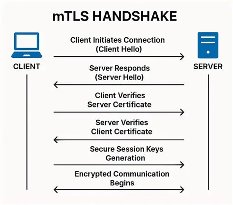
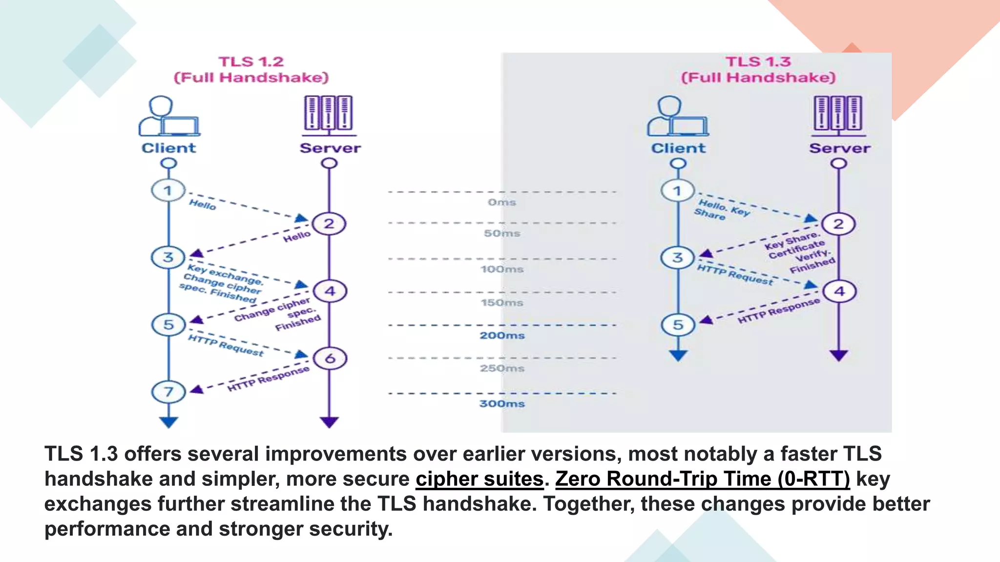

# TLS

TLS（Transport Layer Security）是现在 HTTPS 背后的核心协议。它解决的问题很直接：在一个不可信的网络里，客户端和服务器如何确认对方身份，并协商出后续通信要用的密钥。

TLS 本身不是某一种加密算法，而是把证书、密钥交换、对称加密、哈希和消息认证组合在一起的一套协议。

<!-- more -->

## 概述

HTTP 本身是明文的，如果直接传输登录密码、Cookie 或接口数据，中间人只要能抓包就能看到内容。HTTPS 可以理解为：

$$
\text{HTTPS} = \text{HTTP} + \text{TLS}
$$

也就是说，HTTP 负责应用层语义，TLS 负责在传输前先建立一条安全信道。

TLS 主要保证三件事：

- **机密性**：别人抓到流量也看不懂内容
- **完整性**：传输过程中数据不能被随便篡改
- **身份认证**：客户端能确认自己连到的确实是目标服务器

从整体上看，TLS 的过程可以分成两段：

1. 握手阶段：认证身份，协商密钥
2. 传输阶段：用会话密钥加密通信数据

前者主要依赖非对称密码学，后者主要依赖对称加密。


## 握手流程

TLS 握手的目标是让客户端和服务器在公开网络上得到同一个会话密钥。攻击者可以看到双方发出的报文，但不能推出最终密钥。

一个简化流程如下：

1. 客户端发送 `ClientHello`
2. 服务器返回 `ServerHello` 和证书
3. 客户端验证证书
4. 双方完成密钥交换
5. 双方派生会话密钥
6. 后续数据开始加密传输



### ClientHello

客户端先发一个 `ClientHello`，里面会带上：

- 支持的 TLS 版本
- 支持的密码套件
- 随机数 `ClientRandom`
- 扩展字段，例如 SNI、ALPN、支持的椭圆曲线等

它的作用可以理解为客户端告诉服务器：

> 我支持这些算法和参数，你从里面选一套。

### ServerHello

服务器收到后返回 `ServerHello`，主要包括：

- 选择的 TLS 版本
- 选择的密码套件
- 随机数 `ServerRandom`
- 服务器证书
- 密钥交换需要的参数

这里最重要的是证书和密钥交换参数。证书用来证明服务器身份，密钥交换参数用来生成后续共享秘密。

## 证书

如果没有证书，客户端并不知道自己连到的是不是真服务器。攻击者完全可以伪造一个服务器，截获客户端请求。

证书的作用就是把域名和公钥绑定起来，并由 CA 做背书。

客户端验证证书时通常会检查：

- 证书是否过期
- 域名是否匹配
- 证书链是否能追溯到可信根证书
- 证书是否被吊销


可以把证书链理解为：

$$
\text{服务器证书} \rightarrow \text{中间 CA} \rightarrow \text{根 CA}
$$

只要这条链能接到本地信任的根证书，客户端就可以相信这个服务器公钥确实属于目标域名。

## 密钥交换

TLS 握手中最关键的一步是密钥交换。它要解决的问题是：双方如何在不安全网络里得到同一个秘密值。

以 Diffie-Hellman 思想来看，双方最终会得到：

$$
K = g^{ab} \mod p
$$

其中客户端掌握 $a$，服务器掌握 $b$。攻击者能看到公开参数和交换值，但要从中推出 $K$，本质上要解决离散对数相关问题。


现代 TLS 中更常见的是 ECDHE，也就是椭圆曲线上的临时 Diffie-Hellman 密钥交换。它的好处是可以提供**前向安全性**。

所谓前向安全性，就是即使服务器长期私钥以后泄露，之前抓到的历史流量也不容易被解密。

原因在于每次会话都会生成临时密钥。长期私钥主要用于认证，不直接决定历史会话密钥。

## 会话密钥

密钥交换得到的共享秘密不会直接拿来加密数据，而是会经过 KDF 派生出多组密钥。

这些密钥通常包括：

- 客户端写入密钥
- 服务器写入密钥
- 初始化向量 IV
- 认证相关密钥

可以简单写成：

$$
\text{traffic keys} = \mathrm{KDF}(\text{shared secret}, \text{handshake context})
$$

这里的 `handshake context` 包含握手过程中的随机数、协商参数和握手摘要等信息。

也就是说，会话密钥不是孤立生成的，而是和本次握手过程绑定在一起。

## 记录协议

握手完成之后，应用层数据不会直接发出去，而是交给 TLS Record 层处理。

大致流程如下：

1. 将数据切分为记录
2. 对记录进行加密
3. 加上完整性校验
4. 发送给对方

现代 TLS 常用 AEAD 算法，例如：

- AES-GCM
- ChaCha20-Poly1305

AEAD 的特点是同时提供加密和认证。也就是说，它既保证内容不可读，也能发现数据是否被篡改。

## TLS 1.2 和 TLS 1.3

TLS 1.3 相比 TLS 1.2 做了很多减法。



主要区别包括：

- 握手轮次更少
- 删除 RSA 密钥交换
- 删除 CBC 等旧算法
- 默认使用前向安全的密钥交换
- 握手阶段更多内容被加密保护

TLS 1.2 仍然支持很多历史算法，因此兼容性更强，但协议复杂度也更高。TLS 1.3 则更像一次清理：把容易出问题的旧东西去掉，只保留更现代的方案。

## OpenSSL 查看证书

可以用下面命令查看一个网站的证书和握手信息：

```bash
openssl s_client -connect example.com:443 -servername example.com
```

其中 `-connect` 指定连接地址，`-servername` 用来发送 SNI。现在很多服务器会根据 SNI 返回不同证书，所以一般要带上。

如果只想看证书链，可以这样：

```bash
openssl s_client -connect example.com:443 -servername example.com -showcerts
```


封面来自fjsmu（ふじしむ）
