# 代码逆向基础

软件逆向工程（代码逆向分析）是一种探究应用程序内部组成结构及工作原理的技术。运用逆向分析技术，我们可以轻松窥探程序内部结构，掌握其工作原理，可以在程序的开发与测试阶段发现 Bug 和漏洞，并直接修改程序文件或内存解决这些问题，还可以为程序添加新功能，使程序更强大。

其中分析可执行文件时使用的方法大致分为两种：静态分析法和动态分析法。

## 静态分析法

静态分析法是在不执行代码文件的情形下，对代码进行静态分析的一种方法。静态分析时并不执行代码，而是观察代码文件的外部特征，获取文件的类型（EXE、DLI、DOC、ZIP 等）、大小、PE 头信息、Import/Export API、内部字符串、是否运行时解压缩、注册信息、调试信息、数字证书等多种信息。此外，使用反汇编工具（Disassembler）查看内部代码、分析代码结构也属于静态分析的范畴。

我们通过静态分析方法会获得多种信息，这些信息是进行动态分析的重要参考资料，对代码的动态分析非常有帮助。

## 动态分析法

动态分析法是在程序文件的执行过程中对代码进行动态分析的一种方法，它通过调试来分析代码流，获得内存的状态等。通过动态分析法，我们可以在观察文件、注册表（Registry）、网络等的同时分析软件程序的行为。此外，动态分析中还常常使用调试器（Debugger）分析程序的内部结构与动作原理。

在逆向分析代码时，通常先采用静态分析法收集代码相关信息，然后通过收集到的信息推测程序的结构与行为机制。这些推测对动态分析具有非常高的参考价值，能为动态分析提供很多创意。对程序代码进行逆向分析的过程中，灵活使用静态与动态两种分析方法，动静结合，可以极大地提高代码的分析效率，增加分析的准确性，缩短代码分析时间。

## 逆向分析HelloWorld

学过编程的人编写的第一个程序大概都是 “Hello World!”，这个程序非常简洁，每当看到 “Hello World!” 的源码，都会让人回想起初次学习编程语言的情景，以及当时成功运行时的感动与兴奋。下面，我们也将通过逆向分析 “Hello World!” 程序来开始学习，它非常简单，很适合做入门例题。

```cpp
#include "windows.h"

int main(int argc, char *argv[])
{
    MessageBoxA(NULL,
        "Hello World!",
        "TEST",
        MB_OK);

    return 0;
}
```

编译为可执行文件,进IDA看看

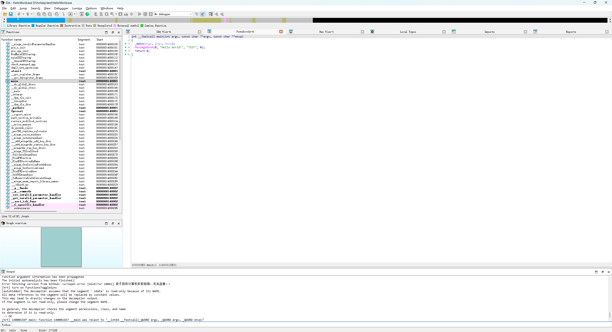

可以看见几乎都还原了

再进dbg看

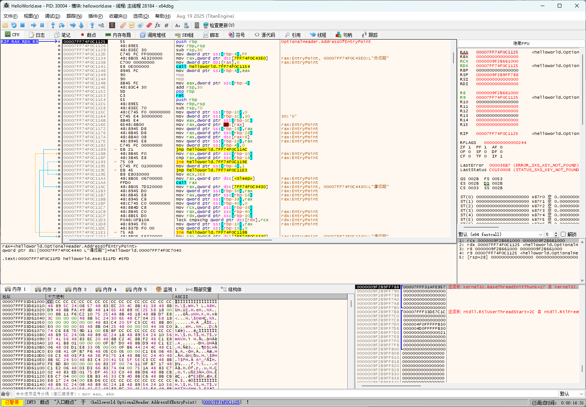

这是一段看上去有些复杂的汇编代码。由于大家尚未掌握汇编语言，所以暂时无法全部理解这段汇编代码的含义。

现在不理解没关系，不用担心，随着学习的不断深入，大家慢慢就会熟悉它，并理解它代表的含义

它们并不是我们在源代码中调用的函数，也不是我们要查找的 main () 函数。其实，这些函数是 Visual C++ 为了保证程序正常运行而自动添加（我们的源码中并没有）的 Visual C++ 启动函数（Stub Code，根据不同的编译器类型与版本，启动函数也会有所不同）。现在并不需要关注它们，后面我会用IDA进行分析,我们的目标是 main () 函数

我们重点关注call和jmp指令

**CALL 指令**用于调用子程序。执行时，它会将当前指令的下一条指令地址压入堆栈，跳转到目标地址执行子程序。子程序完成后，通过 **RET** 指令从堆栈中弹出返回地址，跳回到调用点继续执行。这种机制使得 **CALL** 非常适合函数调用，因为它能够确保程序在执行完子程序后返回原位置。

**JMP 指令**用于无条件跳转。它直接将程序的执行流跳转到目标地址，而不会保存跳转前的位置。执行 **JMP** 后，程序不会返回到原位置，除非显式使用 **CALL** 或 **JMP** 跳回。它通常用于循环控制、跳过代码段或直接跳转到某个函数。

接下来继续查找,我们一直F8单步

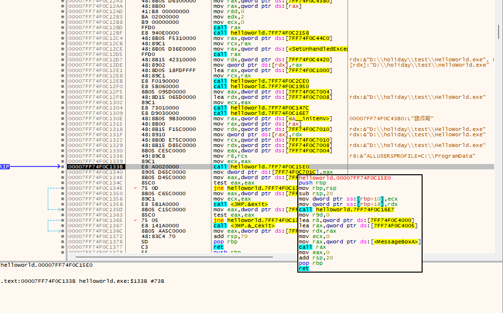

这里出现了我们写的api,即**MessageBoxA**,那么地址00007FF74F0C15E0很有可能就是我们的main函数,F7跟进

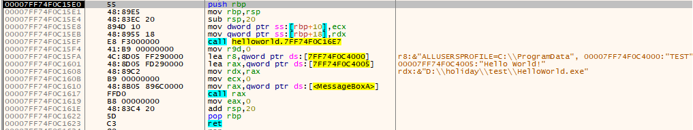

前六行是函数序言,先不用在意

后面是对函数参数的赋值(x64 fastcall调用约定)

| 地址     | 指令                      | 作用                                |
| :------- | :------------------------ | :---------------------------------- |
| `0x15F4` | `mov r9d, 0`              | 第4个参数 `uType = MB_OK (0)`       |
| `0x15FA` | `lea r8, [7FF74F0C4000]`  | 第3个参数 `lpCaption = "TEST"`      |
| `0x1601` | `lea rax, [7FF74F0C4005]` | 取 `"Hello World!"` 地址            |
| `0x1608` | `mov rdx, rax`            | 第2个参数 `lpText = "Hello World!"` |
| `0x160B` | `mov ecx, 0`              | 第1个参数 `hWnd = NULL`             |

最后call

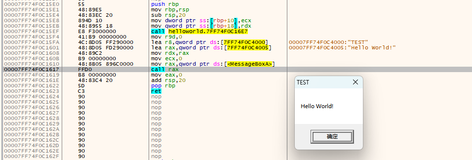

## 打补丁修改字符串

代码逆向分析中，“打补丁” 操作是不可或缺的重要主题。利用 “打补丁” 技术不仅可以修复已有程序中的 Bug，还可以向程序中添加新功能。“打补丁” 的对象可以是文件、内存，还可以是程序的代码、数据等。我们将使用 “打补丁” 技术把 HelloWorld.exe 程序消息窗口显示的 “Hello World!” 字符串更改为其他字符串

下面介绍 2 种简单的修改字符串的方法

① 直接修改字符串缓冲区（buffer）

② 在其他内存区域生成新字符串并传递给消息函数

### 直接修改字符串缓冲区

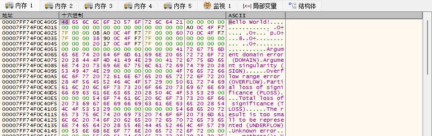

MessageBoxA 函数的字符串参数 “Hello World!” 保存在地址 C4005 处的一段缓冲区中，只要修改这段内容，就可以修改 MessageBoxA 函数显示出的字符串。在内存窗口选中要修改的字符串.按 Ctrl+E 快捷键打开编辑窗口

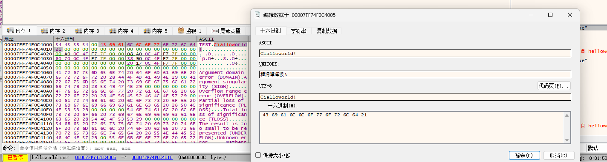

虽然指令保持不变，但原字符串已经被新字符串取代，用作 MessageBoxA () 函数的参数，并且参数的地址仍为 4092A0，只是该地址空间中的内容（字符串）发生了改变。按 F9 键运行程序后，将弹出消息窗口，可以看到显示出的新字符串。

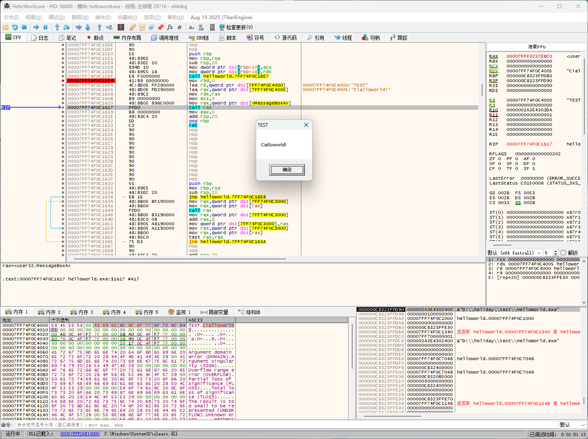

若新字符串长度大于原有字符串，执行覆盖操作时可能损坏字符串后面的数据，所以一定要小心。特别是字符串后面有非常重要的数据时，覆盖操作导致数据损坏就会引发程序内存引用错误

可执行文件保存字符串时一般会给字符串多留出一些空间。所以，如果你的运气足够好，使用更长的字符串覆盖原字符串时，即使原字符串后面的部分空间被侵占，程序仍然能正常运行

上面的调试中，我们通过修改字符串缓冲区更改了程序显示的消息内容，但是这种更改只是暂时的，终止调试（即 HelloWolrd.exe 进程结束）后，程序中的原字符串仍然没有改变。如果想把这种更改永久保存下来，就要把更改后的程序另保存为一个可执行文件

### 在其他内存区域新建字符串并传递给消息函数

按 Ctrl+F2 快捷键重启调试,再看一下 main () 函数

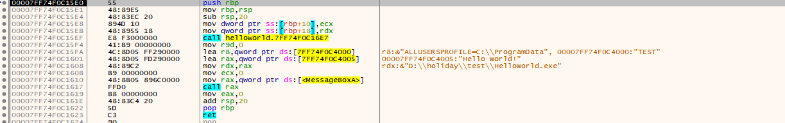

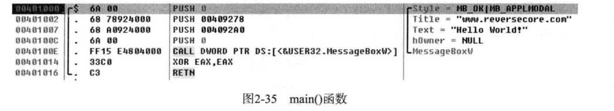

这里和原著有点不一样,原著是x86,遵循**stdcall调用约定**

- 参数**全部压栈传递**，从右往左 PUSH 入栈
- `MessageBoxW` 4 个参数：父窗口、文本、标题、弹窗样式，全部用`PUSH`指令压入栈；

不过思想是一样的,向 MessageBoxW () 函数传递字符串参数时，传递的是字符串所在区域的首地址。如果改变了字符串地址，消息框就会显示变更后的字符串。在内存的某个区域新建一个长字符串，并把新字符串的首地址传递给 MessageBoxW () 函数，可以认为传递的是完全不同的字符串地址

那上面的想法相当不错，但还要考虑另一个问题：“应该在内存的哪块区域创建新字符串呢？” 要想解开答案，需要掌握 PE 文件格式与虚拟地址（Virtual Address）结构的相关知识，后面章节中会详细讲解。此处任选一块区域即可

我们定位Hello world!字符串在内存中的位置,往下翻,会发现一大片内存区域由**NULL填充**(NULL padding)结束

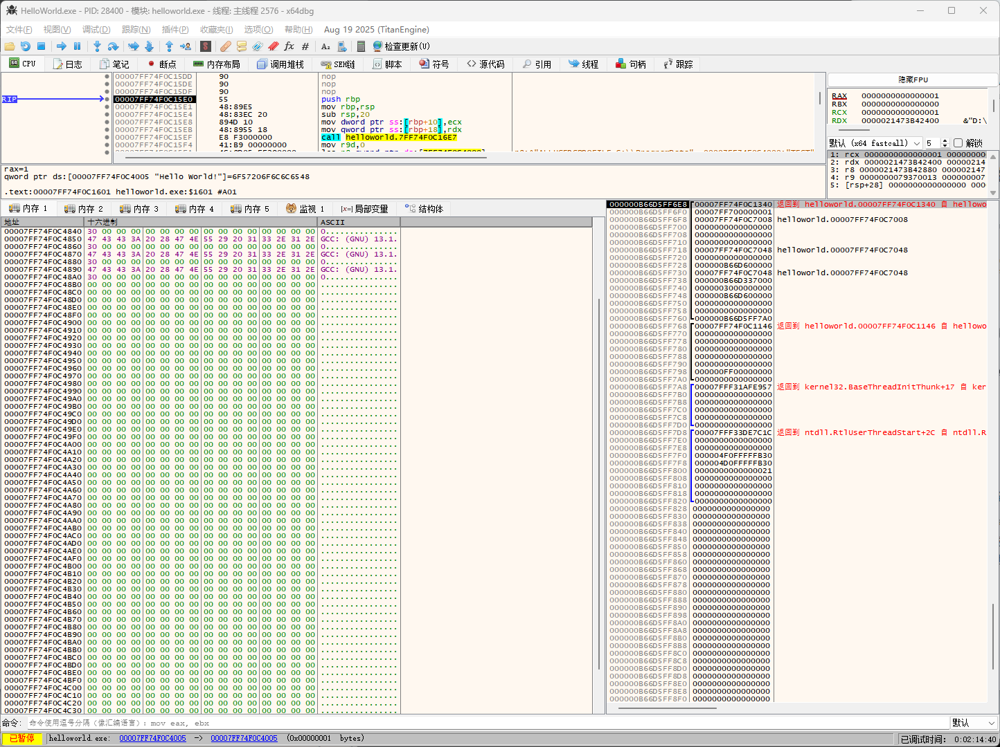

这就是程序中未使用的NULL填充区

应用程序被加载到内存时有一个最小的内存分配大小，一般为 10000。即使程序运行时只占用 100 内存，它被加载到内存时仍然会分到 10000 左右的内存，这些内存一部分被程序占用，其余部分为空余区域，全部被填充为 NULL

选一块地址进行赋值,记下地址00007FF74F0C4900

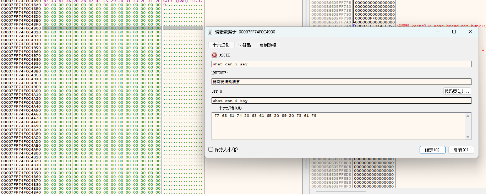

仅进行上述操作无法更改消息框中的字符串。既然已经新建了缓冲区，接下来就应该把新的缓冲区地址作为参数传递给 MessageBoxW () 函数。为此，我们需要在代码窗口中使用汇编命令修改代码。将光标置于地址 00007FF74F0C1601 处，按空格键打开 Assemble 窗口,将地址修改为新字符串的首地址

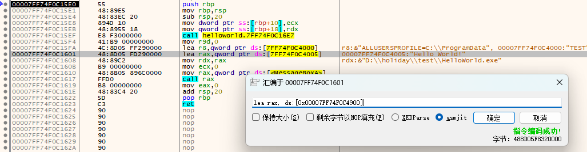

F9运行

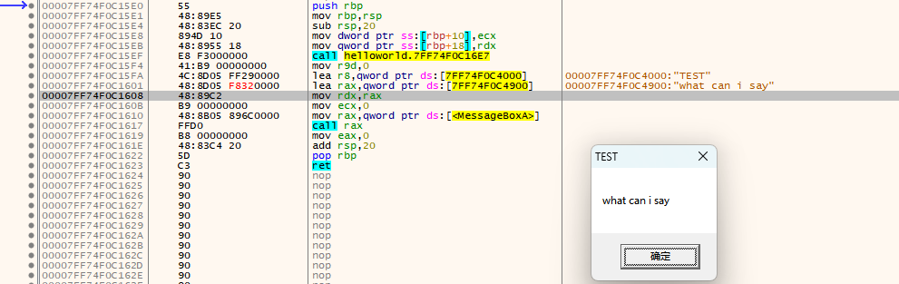

若把修改后的代码重新保存为程序文件，可以发现程序无法正常运行，这是由 00007FF74F0C4900这一地址引起的。可执行文件被加载到内存并以进程形式运行时，文件并非原封不动地被载入内存，而是要遵循一定规则进行。这一过程中，通常进程的内存是存在的，但是相应的文件偏移（offset）并不存在。上面示例中，与内存 00007FF74F0C4900对应的文件偏移就不存在，所以修改后的程序无法正常运行。若想进一步了解其中原理，需要学习 PE 文件格式相关知识。

## 小结

| 指令      | 说明                   |
| --------- | ---------------------- |
| CALL XXXX | 调用 XXXX 地址处的函数 |
| JMP XXXX  | 跳转到 XXXX 地址处     |
| PUSH XXXX | 保存 XXXX 到栈         |
| RETN      | 跳转到栈中保存的地址   |

| 术语                     | 说明                                   |
| ------------------------ | -------------------------------------- |
| VA (Virtual Address)     | 进程的虚拟地址                         |
| OP code (OPeration code) | CPU 指令（字节码 byte code）           |
| PE (Portable Executable) | Windows 可执行文件（EXE、DLL、SYS 等） |

Q. 什么是启动函数？

A. 首先，启动函数（Stub code）不是用户编写的代码，而是编译器自动添加的代码。编译程序时，不同编译器会根据自身特点添加不同启动函数，特别是 EP 代码区域中存在着许多启动函数，它们也被称为启动代码（StartUp code）。调试程序时，我们不需要仔细分析这些启动函数，但是初学者有必要分清程序中哪些是启动函数，哪些是用户代码。希望大家调试时多看一看这些代码，熟悉后就能轻松区分。

Q. 到底什么是 PE 文件，为什么要等到后面才讲解？如果不懂得 PE 文件是否就无法调试？

A. PE 是 Portable Executable 的简称，它是 Windows 操作系统下的可执行文件的格式，主要包含了对文件规格的描述，代码逆向分析技术的初学者学习它会感到非常吃力、无趣。所以我们并没有在前面详细讲解，更重要的是先让大家感受到调试的乐趣，然后再一点点地学习。此外，如果不了解 PE 文件结构的相关知识，将无法进行高级调试。

## 小端序标记法

计算机领域中，字节序（Byte Ordering）是多字节数据在计算机内存中存储或网络传输时各字节的存储顺序，主要分为两大类：**小端序**（Little endian）、**大端序**（Big endian）

```asm
BYTE  b  = 0x12;
WORD  w  = 0x1234;
DWORD dw = 0x12345678;
char  str[] = "abcde";
```

以上代码共 4 种不同大小的数据类型，同一数据按不同字节序存储结果存在差异。 

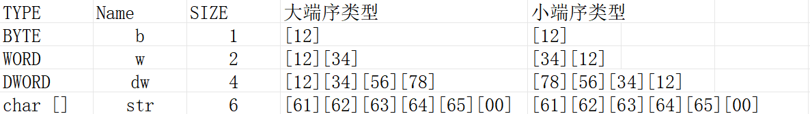

数据类型为字节型（BYTE）时，其长度为 1 个字节，保存这样的数据时，无论采用大端序还是小端序，字节顺序都是一样的。但是数据长度为 2 个字节以上（含 2 个字节）时，采用不同字节序保存它们形成的存储顺序是不同的。

采用大端序存储数据时，内存地址低位存储数据的高位，内存地址高位存储数据的低位，这是一种最直观的字节存储顺序；

采用小端序存储数据时，地址高位存储数据的高位，地址低位存储数据的低位，这是一种逆序存储方式，保存的字节顺序被倒转。变量 w 与 dw 中的值就能了解大端序与小端序的不同。

再次强调一下，数据为单一字节时，无论采用大端序还是小端序保存，字节存储顺序都一样。只有数据长度在 2 个字节以上时，即数据为多字节数据（multi-bytes）时，选用大端序还是小端序会导致数据的存储顺序不同。字符串 “abcde” 被保存在一个字符（Char）数组 str 中，因为字符数组在内存中是连续的，此时向字符数组存放数据，无论采用大端序还是小端序，存储顺序都相同。

### 大端序和小端序

采用大端序保存多字节数据非常直观，它常用于大型 UNIX 服务器的 RISC 系列的 CPU 中。此外，网络协议中也经常采用大端序方式。了解这些，对从事 x86 系列应用程序的开发人员以及代码逆向分析人员具有非常重要的意义，因为通过网络传输应用程序使用数据时，往往都需要修改字节序。

如果字节序仅有大端序这一种类型，那么就没什么可说的了。但不幸的是，它还包括另一种类型 ——Intel x86 CPU 采用的小端序。所以，对我们这些从事 Windows 程序逆向分析的人来说，切实掌握小端序是十分必要的。小端序采用逆序方式存储数据，使用小端序进行算术运算以及扩展 / 缩小数据时，效率都非常高。

### 查看小端序

测试代码

```cpp
#include "windows.h"

BYTE  b    = 0x12;
WORD  w    = 0x1234;
DWORD dw   = 0x12345678;
char  str[]= "abcde";

int main(int argc, char *argv[])
{
    byte  lb  = b;
    WORD  lw  = w;
    DWORD ldw = dw;
    char  *lstr = str;

    return 0;
}
```

编译后进dbg

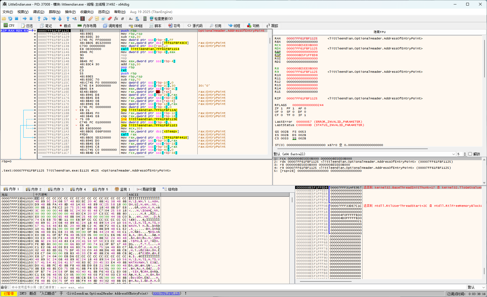

还是断在了这里,依旧是一大片的启动函数,不用管,往下找

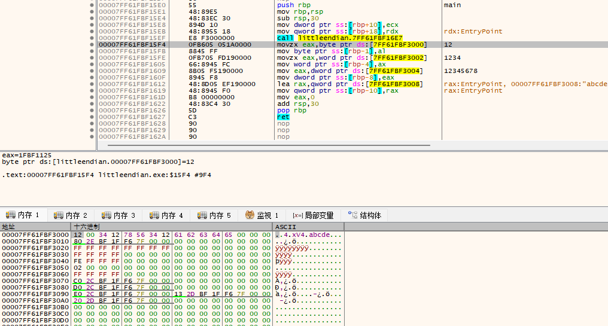

这里是main函数,内存中为对应的赋值

可以注意到变量w和dw的数据采用小端序存储

## ia32寄存器

学习程序调试技术前必须掌握 IA-32（Intel Architecture 32 位）寄存器相关内容。寄存器是 CPU 内部的高速存储单元，CPU 访问寄存器的速度远高于访问内存——因为 CPU 与内存之间的物理路径更长，而寄存器集成在 CPU 核心，读写几乎零延迟。

为什么要学寄存器？因为在反汇编和调试时，看到的全是汇编指令，而绝大多数汇编指令都在操作寄存器。遇到不懂的指令就去翻 Intel 提供的用户手册，这是学习汇编最踏实的路径。

### IA-32 寄存器分类

IA-32 是 Intel 的 32 位 CISC 架构，功能丰富，寄存器种类也多。从用途上可以分为以下几类：

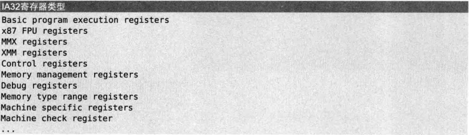

- **基本程序运行寄存器**（Basic Program Execution Registers）——编程和调试最常用，也是初学者的重点
- **x87 FPU 寄存器**——浮点运算单元寄存器
- **MMX 寄存器**——多媒体扩展寄存器
- **XMM 寄存器**——流式 SIMD 扩展寄存器
- **控制寄存器**——控制系统级行为
- **内存管理寄存器**——管理分段和分页
- **调试寄存器**——硬件断点支持
- **内存类型范围寄存器**
- **机器特定寄存器**
- **机器检查寄存器**

初学者先掌握基本程序运行寄存器就够了。控制寄存器、内存管理寄存器、调试寄存器等属于进阶内容，在后续调试实践中再逐步深入。

### 基本程序运行寄存器

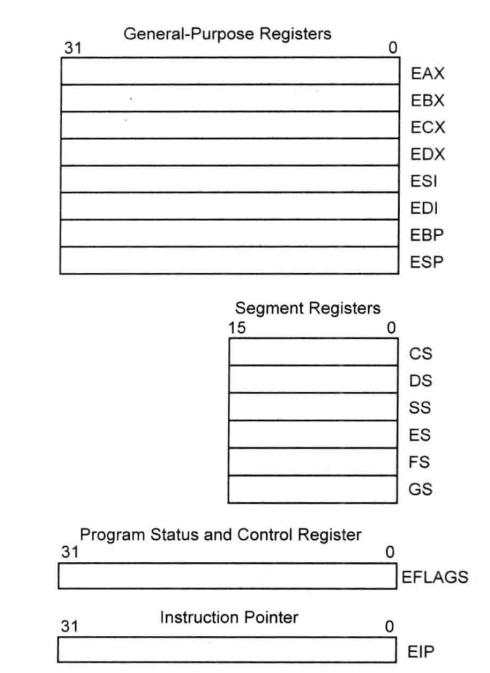

基本程序运行寄存器是编写和阅读汇编代码时打交道最多的一组寄存器，共 16 个，分为四类：

- **通用寄存器**：32 位，8 个（EAX、EBX、ECX、EDX、ESI、EDI、EBP、ESP）
- **段寄存器**：16 位，6 个（CS、DS、SS、ES、FS、GS）
- **程序状态与控制寄存器**：32 位，1 个（EFLAGS）
- **指令指针寄存器**：32 位，1 个（EIP）

寄存器名前面的字母 `E` 代表 Extended（扩展），意思是这些寄存器在 16 位 CPU（IA-16）时代就已经存在，到了 IA-32 被从 16 位扩展到 32 位。访问时可以只取低 16 位（如 `AX`），也可以用完整的 32 位（如 `EAX`）。

### 通用寄存器

通用寄存器用于数据传送、暂存数据、算术和逻辑运算以及保存结果。每个寄存器 32 位（4 字节），既可以存常数也可以存地址，由具体的汇编指令决定用途。其中部分寄存器有特定的隐含功能。

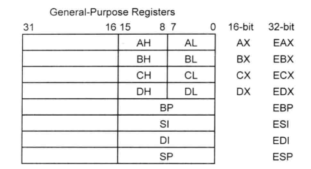

从图中可以看到，EAX、EBX、ECX、EDX 四个寄存器可以进一步拆分：

- 低 16 位可以独立访问，叫 `AX`/`BX`/`CX`/`DX`
- 这 16 位又能拆成两个 8 位：高 8 位 `AH`/`BH`/`CH`/`DH`，低 8 位 `AL`/`BL`/`CL`/`DL`

以 EAX 为例：完整 32 位是 `EAX`（位 0\~31），低 16 位是 `AX`（位 0\~15），`AX` 的高 8 位是 `AH`（位 8\~15），低 8 位是 `AL`（位 0\~7）。修改 `AL` 会同时影响 `AX` 和 `EAX`，因为它们是重叠的，不是独立的存储单元。

而 EBP、ESI、EDI、ESP 只能以 32 位或低 16 位访问，不能再拆成 8 位。

各通用寄存器的特定用途：

| 寄存器  | 名称           | 主要用途                      |
| ------- | -------------- | ----------------------------- |
| **EAX** | 累加器         | 算术运算                      |
| **EBX** | 基址寄存器     | DS 段中的数据指针             |
| **ECX** | 计数器         | 字符串操作和循环的计数器      |
| **EDX** | 数据寄存器     | I/O 指针、乘除法辅助          |
| **EBP** | 扩展基址指针   | SS 段中栈内数据指针，建立栈帧 |
| **ESI** | 源变址寄存器   | 字符串操作的源地址            |
| **EDI** | 目的变址寄存器 | 字符串操作的目的地址          |
| **ESP** | 栈指针寄存器   | 始终指向栈顶                  |

EAX、EBX、ECX、EDX 四个寄存器常用于算术运算（`ADD`、`SUB`、`XOR`、`OR` 等），也用于存储常量和变量。有些指令直接绑定特定寄存器：`MUL`/`DIV` 隐含使用 EAX 和 EDX，`LODS`/`STOS`/`MOVS` 使用 ESI 和 EDI，`LOOP` 指令每轮自动递减 ECX。在 Win32 API 调用中，函数返回值放在 EAX 里。

Win32 API 函数内部会使用 ECX 和 EDX，调用 API 前如果这两个寄存器里存着有用的数据，要先备份（`PUSH` 到栈上），否则会被覆盖。

EBP 用于建立栈帧。函数被调用时，通常先 `PUSH EBP` 保存调用者的 EBP，再 `MOV EBP, ESP` 把当前栈顶设为新帧基址，之后通过 `EBP + 偏移` 访问参数和局部变量。ESP 在 `PUSH`、`POP`、`CALL`、`RET` 时自动变化，始终指向栈顶，不应挪作他用。

ESI 和 EDI 配合字符串指令使用：`LODS` 从 ESI 指向的地址读数据到 EAX，`STOS` 把 EAX 写到 EDI 指向的地址，`MOVS` 在 ESI 和 EDI 之间搬数据，配合 `REP` 前缀可以用 ECX 控制重复次数。

### 段寄存器

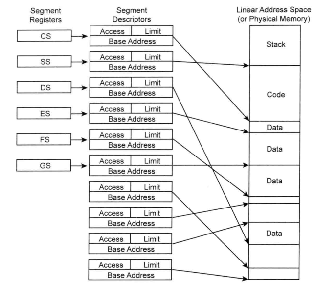

段的概念来自 IA-32 的内存管理模型。在保护模式下，CPU 通过分段机制实现内存保护：段寄存器里存的是段选择子（Selector），CPU 用它去查段描述符表（GDT/LDT），拿到段基址、段限长和访问权限，再计算出线性地址。如果开启了分页，线性地址还要经过页表翻译成物理地址；如果没开分页，线性地址就是物理地址。

6 个段寄存器都是 16 位：

| 寄存器 | 名称   | 用途                           |
| ------ | ------ | ------------------------------ |
| **CS** | 代码段 | 指向当前正在执行的代码段       |
| **SS** | 栈段   | 指向当前栈段（配合 ESP/EBP）   |
| **DS** | 数据段 | 指向默认数据段                 |
| **ES** | 附加段 | 额外数据段，字符串操作的目的段 |
| **FS** | 数据段 | 附加数据段，Windows 下指向 TEB |
| **GS** | 数据段 | 附加数据段                     |

段寄存器的细节比较复杂，初学阶段不必深究。现代操作系统（Windows、Linux）在保护模式下大多使用平坦内存模型（Flat Model），各段基址都设为 0、段限长设为 4GB，分段机制实际上被绕过了。但在调试时，FS 寄存器很重要：它指向线程环境块（TEB），通过 FS 可以访问 SEH（结构化异常处理）、TEB 和 PEB（进程环境块），这些是高级调试和逆向的关键结构。

### 程序状态与控制寄存器 EFLAGS

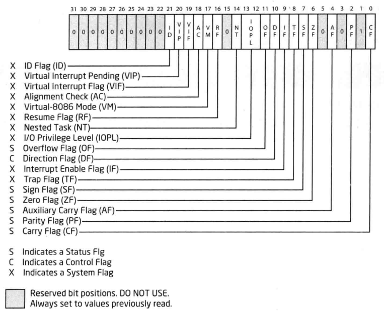

上图展示了分段内存模型：段寄存器（左）通过段描述符（中）映射到线性地址空间（右）中的不同区域——栈、代码、数据等。FS 和 GS 在实际使用中可以指向特殊段（如 TEB 所在的段）。

EFLAGS 是标志寄存器，32 位，从 16 位的 FLAGS 扩展而来。它的每一位都有独立含义，值为 1 表示"置位"（On/True），值为 0 表示"清除"（Off/False）。有的位由 CPU 根据指令执行结果自动设置，有的位可以由程序指令修改。

EFLAGS 有 32 位，先掌握三个最关键的标志位：

| 标志   | 名称                      | 含义                         |
| ------ | ------------------------- | ---------------------------- |
| **ZF** | 零标志（Zero Flag）       | 运算结果为零时置 1，否则清 0 |
| **OF** | 溢出标志（Overflow Flag） | 有符号数运算溢出时置 1       |
| **CF** | 进位标志（Carry Flag）    | 无符号数运算进位/借位时置 1  |

### 指令指针寄存器 EIP

EIP 是指令指针寄存器，32 位，从 16 位的 IP 扩展而来。它保存的是 CPU 下一条要执行的指令地址。

CPU 的工作循环是：读取 EIP 指向的指令 → 送入指令缓冲区 → EIP 自动增加当前指令的字节长度 → 执行指令 → 重复。正常顺序执行时，EIP 就这样一直递增。

EIP 不能像通用寄存器那样用 `MOV` 直接修改。改变 EIP 的方式都是间接的：

- `JMP`、`Jcc`（条件跳转）直接设置 EIP
- `CALL` 把返回地址压栈后跳转
- `RET` 从栈中弹出地址写回 EIP
- 中断和异常也会修改 EIP

调试器设断点时，实际上就是在 EIP 指向的位置暂停，让你查看那一刻所有寄存器的状态。

## 栈

栈（Stack）的用途广泛，通常用于存储局部变量、传递函数参数、保存函数返回地址等。调试程序时需要不断查看栈内存，所以掌握栈的运行原理对于提升程序调试水平是非常有帮助的。

栈内存在进程中的作用如下：

(1) 暂时保存函数内的局部变量。

(2) 调用函数时传递参数。

(3) 保存函数返回后的地址。

栈其实是一种数据结构，它按照 FILO（First In Last Out，后进先出）的原则存储数据。一会通过一个示例来证明这一点。

### 栈的特征

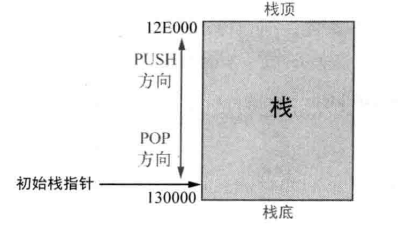

一个进程中，栈顶指针（ESP）初始状态指向栈底端。执行 PUSH 命令将数据压入栈时，栈顶指针就会上移到栈顶端。执行 POP 命令从栈中弹出数据时，若栈为空，则栈顶指针重新移动到栈底端。换言之，栈是一种由高地址向低地址扩展的数据结构，图 5-1 中，栈是由下往上扩展的。由于栈具有这种特征，所以我们常常说 “栈是逆向扩展的”，向栈中压数据就像一层层砌砖，每向上砌一层，砖墙就增高一点儿。

## 栈操作示例

给定伪代码

```cpp
#include <windows.h>

int main()
{
    __asm__ __volatile__(
        "push $0x100\n\t"
        "pop %%eax\n\t"
        "nop\n\t"
        ::: "eax", "esp", "memory"
    );
    return 0;
}
```

给定初始状态

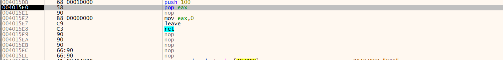

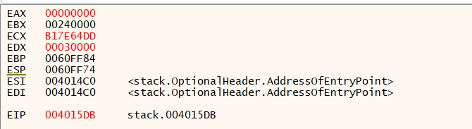

初始状态下，ESP 为 60FF74。按 F7 键（Step Into）执行地址 4015DB 处的 PUSH 100 命令后

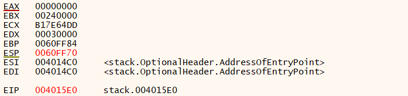

如图所示，ESP 值变为 60FF70，减少了 4 个字节，值 100 存入栈。ESP 向上（低地址）移动。

接着执行 POP EAX 命令，栈顶值 100 弹出至 EAX，ESP 恢复为 60FF74。

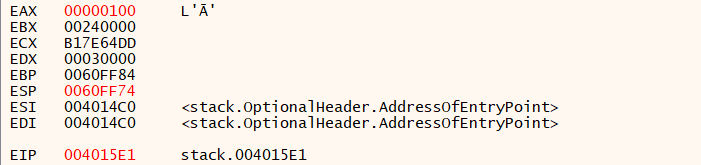

向栈压入数据时，栈顶指针减小，向低地址移动；从栈中弹出数据时，栈顶指针增加，向高地址移动。

还请记住，栈顶指针在初始状态下指向栈底。这就是栈的特征。

上面这个简单示例验证了栈的工作原理，展现了向栈压入或弹出数据时栈顶指针的变化规律。程序调试中栈与栈顶指针的变化是十分重要的，调试时要密切关注。

## 分析abex' carckme

本章我们将分析一个非常简单的 crackme 小程序，以进一步熟悉调试器与汇编代码。当然，我们的目标并不是为了破解（Crack）它，而是通过它来加深对汇编代码与调试技术的认识。

顾名思义，crackme 就是 “破解我” 的意思，它们都是一些公开用作破解练习的小程序。作为代码逆向分析技术的初学者，尝试分析一些简单的 crackme 小程序可以验证自己掌握的技术，加深对调试器及汇编代码的认识。Abex' crackme 就是这样一个简单的著名小程序，国内外有许多网站都对它进行了详细讲解与说明。将自己的破解方法与其他人的相比较，这样能进一步提高自己的水平。

调试前先运行 abex' crackme #1 这个程序，大致了解一下它。

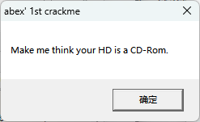

就是让程序觉得我的HD是CD-Rom,点一下确定看看

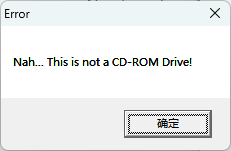

再就没有了,进dbg看看

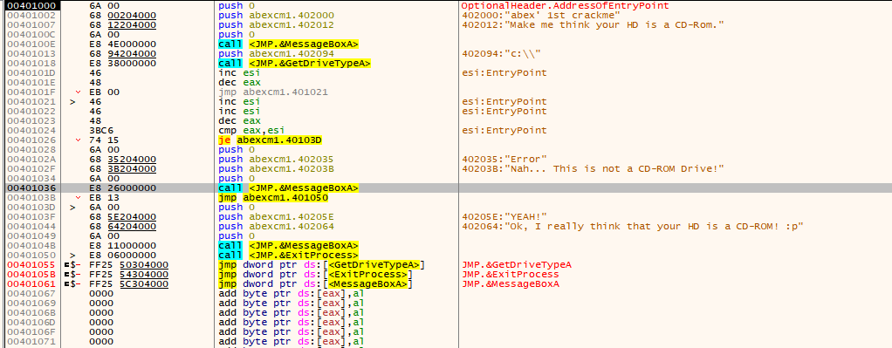

这一部分原著讲的很好,直接贴了

EP 代码非常短，它与我们前面分析的 HelloWorld.exe 有非常大的不同。这是因为 abex' crackme 程序是使用汇编语言编写出来的可执行文件。

使用 VC++、VC、Delphi 等开发工具编写程序时，除了自己编写的代码外，还有一部分启动函数是由编译器添加的，经过反编译后，代码看上去就变得非常复杂。但是如果直接使用汇编语言编写程序，汇编代码会直接变为反汇编代码。观察图中的代码可以看到，main () 直接出现在 EP 中，简洁又直观，充分证明了这是一个直接用汇编语言编写的程序。

因为代码非常简短,一点到分析,重点关注图中API调用的内容

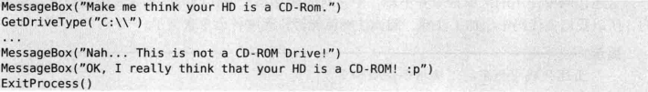

如果之前大家从事过Windows应用程序的开发，那么对以上几个函数的含义应该非常了解。从上述代码的分析中，我们能够准确把握程序制作者的真正意图。在消息窗口按"确定"后，程序会调用GetDriveType() API，获取CD驱动器的类型（大部分返回的是HDD类型），然后操作它，使之被识别为CD-ROM类型，再在消息窗口中输出"OK, I really think that your HD is a CD-ROM! :p"消息。下面逐行分析crackme的代码。

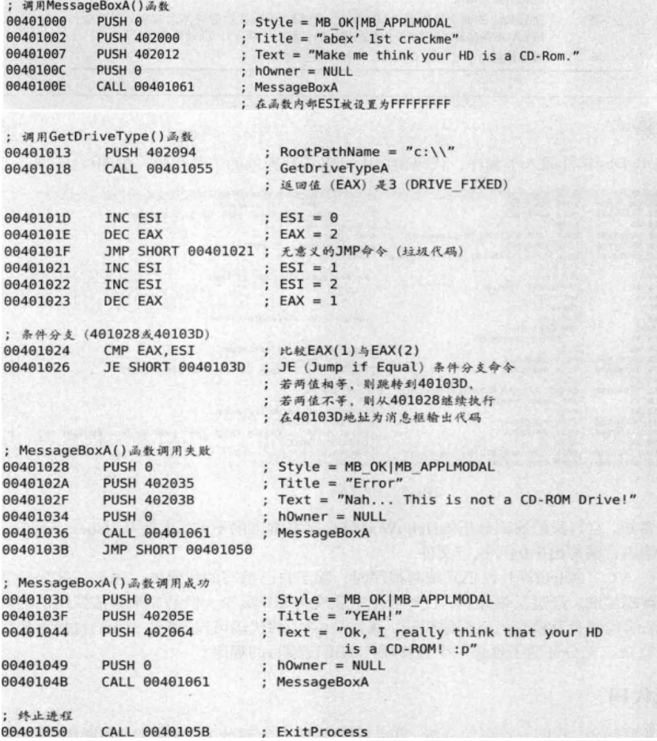

| 指令 | 说明                                                         |
| ---- | ------------------------------------------------------------ |
| PUSH | 入栈指令                                                     |
| CALL | 调用指定位置的函数                                           |
| INC  | 值加 1                                                       |
| DEC  | 值减 1                                                       |
| JMP  | 跳转到指定地址                                               |
| CMP  | 比较给定的两个操作数 * 与 SUB 命令类似，但操作数的值不会改变，仅改变 EFLAGS 寄存器（若 2 个操作数的值一致，SUB 结果为 0，ZF 被置为 1） |
| JE   | 条件跳转指令（Jump if equal） * 若 ZF 为 1，则跳转           |

### 破解

很明显我们想弹出"Ok, I really think that your HD is a CD-ROM! :p"这个字符串

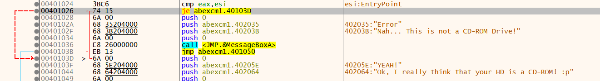

关键在于ZF的标志位,若为1则跳转到40103D 

我们可以直接改为无条件跳转jmp,即不论ZF标志位,都跳转

ctrl+p保存运行即可

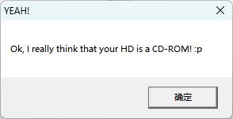

## 将参数压入栈

函数调用时将参数压入栈的方法,就拿刚才这个程序举例

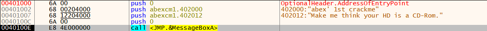

可以发现调用 MessageBoxA () 函数之前执行了 4 个 PUSH 命令，把函数需要的参数逆序压入栈

将上述汇编代码转换为 C 语言函数调用代码，如下所示。

```cpp
MessageBox(NULL, "Make me think your HD is a CD-Rom.", "abex' 1st crackme", MB_OK|MB_APPLMODAL);
```

比较 C 语言代码与汇编代码可以看到，函数调用时的参数顺序（正序）与参数入栈时的顺序（逆序）相反。那么参数入栈时，为什么要采用这种逆序的方式呢？要想理解这个问题，想清楚栈结构（FILO，First In Last Out 或 LIFO，Last In First Out）即可。

“栈的结构是 FILO（先进后出），所以把参数压入栈时，只有按照逆序的方式压入，MessageBoxA () 函数才能以正确的顺序接收到这些参数。”

利用调试器执行到 EIP=0040100E 地址处，观察栈窗口

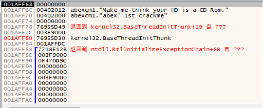

x86 环境下，栈向低地址延伸（即向栈压入数据时，ESP 值减小，向低地址方向移动），观察栈窗口可以看到，MessageBoxA () 函数的第一个参数在栈顶位置，最后一个参数（第四个参数）在其他参数下面，从 PUSH 命令执行的顺序可以很容易地理解这点。

MessageBoxA () 函数从栈中获取需要的参数时，存储在栈中的参数会按照 FILO（先进后出）的规则依次弹出。从 MessageBoxA () 函数获取参数的角度来看，参数就像按照原来顺序被存入栈一样。

## 栈帧

我们将学习栈帧（Stack Frame）相关知识，栈帧在程序中用于声明局部变量、调用函数。理解了栈帧，就能轻松掌握保存在其中的函数参数和局部变量，这对我们调试代码也是很有帮助的。

简言之，栈帧就是利用 **EBP**（栈帧指针，请注意不是 ESP）寄存器访问栈内局部变量、参数、函数返回地址等的手段。通过前面关于 IA-32 寄存器的学习我们知道，ESP 寄存器承担着栈顶指针的作用，而 EBP 寄存器则负责行使栈帧指针的职能。程序运行中，ESP 寄存器的值随时变化，访问栈中函数的局部变量、参数时，若以 ESP 值为基准编写程序会十分困难，并且也很难使 CPU 引用到准确的地址。所以，调用某函数时，先要把用作基准点（函数起始地址）的 ESP 值保存到 EBP，并维持在函数内部。这样，无论 ESP 的值如何变化，以 EBP 的值为基准（base）能够安全访问到相关函数的局部变量、参数、返回地址，这就是 EBP 寄存器作为栈帧指针的作用。

接下来看看栈帧对应的汇编代码。

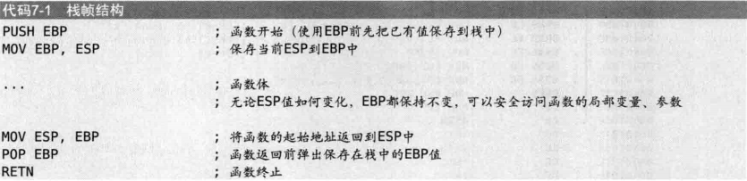

借助栈帧技术管理函数调用时，无论函数调用的深度有多深、多复杂，调用栈都能得到很好的管理与维护。

**提示**

- 最新的编译器中都带有一个 “优化”（Optimization）选项，使用该选项编译简单的函数将不会生成栈帧。
- 在栈中保存函数返回地址是系统安全隐患之一，攻击者使用缓冲区溢出技术能够把保存在栈内存的返回地址更改为其他地址。

### 调试示例

下面调试一个非常简单的程序来进一步了解栈帧相关知识。

```cpp
// StackFrame.cpp
#include "stdio.h"

long add(long a, long b)
{
    long x = a, y = b;
    return (x + y);
}

int main(int argc, char* argv[])
{
    long a = 1, b = 2;
    printf("%d\n", add(a, b));
    return 0;
}
```

关闭优化选项后编译

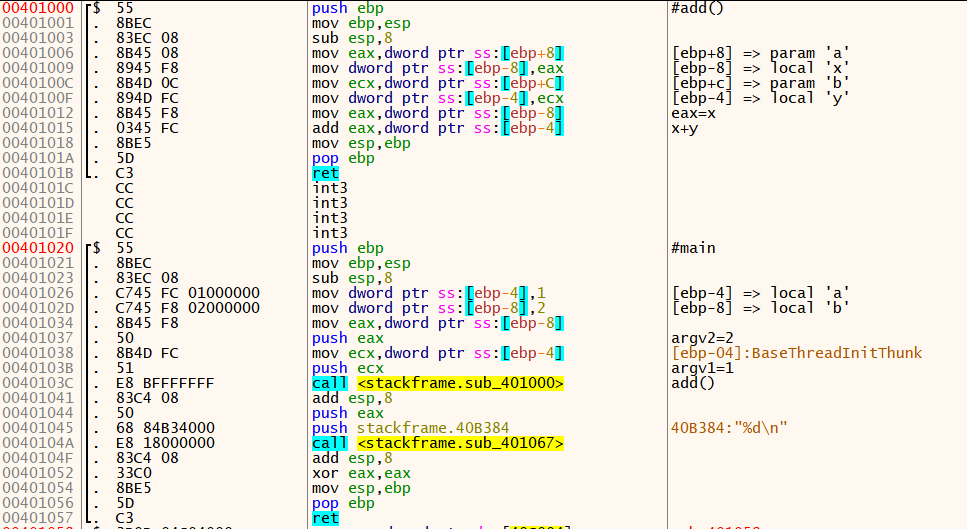

### main函数及栈帧

函数`main()`是程序开始执行的地方,`main()`函数的起始地址为401020

开始执行`main()`函数时栈的状态如图所示。从现在开始要密切关注栈的变化

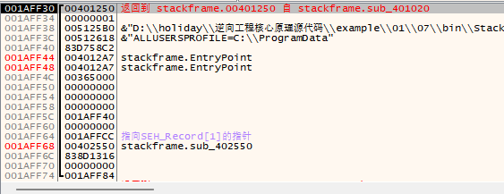

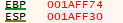

当前ESP的值为1AFF30,EBP的值为16FF74,切记地址401250保存在ESP(1AFF30)中,它是main()函数执行完毕后要返回的地址

```asm
00401020 PUSH EBP        ; # main()
```

PUSH 是一条压栈指令，上面这条 PUSH 语句的含义是 “把 EBP 值压入栈”。`main()`函数中，EBP 为栈帧指针，用来把 EBP 之前的值备份到栈中（`main()`函数执行完毕，返回之前，该值会再次恢复）。

```asm
00401021 MOV EBP,ESP
```

MOV 是一条数据传送命令，上面这条 MOV 语句的命令是 “把 ESP 值传送到 EBP”。换言之，从这条命令开始，EBP 就持有与当前 ESP 相同的值，并且直到`main()`函数执行完毕，EBP 的值始终保持不变。也就是说，我们通过 EBP 可以安全访问到存储在栈中的函数参数与局部变量。执行完 401020 与 401021 地址处的两条命令后，函数`main()`的栈帧就生成了（设置好 EBP 了）。

### main设置局部栈帧

下面分析变量声明及赋值语句

```cpp
long a = 1, b = 2;
```

main () 函数中，上述语句用于在栈中为局部变量 (a,b) 分配空间，并赋初始值

那么函数中声明的变量 a、b 是如何在函数栈中生成的，又是如何管理的呢？

```asm
00401023 SUB ESP,8
```

SUB 是汇编语言中的一条减法指令，上面这条语句用来将 ESP 的值减去 8 个字节。执行该条命令之前，ESP 的值为 1AFF2C(因为push ebp,即1AFF30-4)，减去 8 个字节后，变为 1AFF24。那么为什么要将 ESP 减去 8 个字节呢？从 ESP 减去 8 个字节，其实质是为函数的局部变量（a 与 b ）开辟空间，以便将它们保存在栈中。由于局部变量 a 与 b 都是 long 型（长整型），它们分别占据 4 个字节大小，所以需要在栈中开辟 8 个字节的空间来保存这 2 个变量。

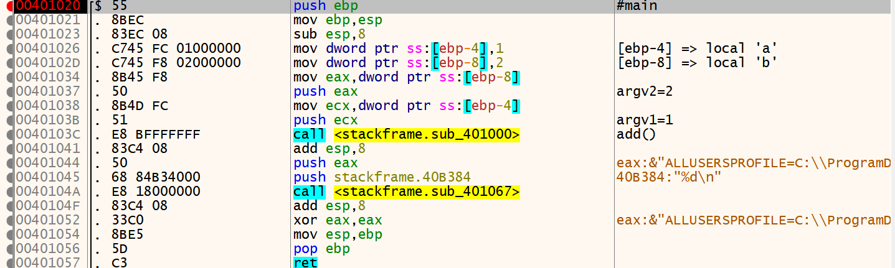

使用 SUB 指令从 ESP 中减去 8 个字节，为 2 个函数变量开辟好栈空间后，在 main () 内部，无论 ESP 的值如何变化，变量 a 与 b 的栈空间都不会受到损坏。由于 EBP 的值在 main () 函数内部是固定不变的，我们就能以它为基准来访问函数的局部变量了。继续看如下代码。

```asm
00401026 MOV DWORD PTR SS:[EBP-4],1  ; [EBP-4] = local 'a'
0040102D MOV DWORD PTR SS:[EBP-8],2  ; [EBP-8] = local 'b'
```

对于刚刚接触汇编语言的朋友来说，上面两条命令中的 `DWORD PTR SS:[EBP-4]` 部分可能略显陌生。其实没什么难的，只要把它们看作类似于 C 语言中的指针就可以了。

| 汇编语言             | C 语言             | 类型转换         |
| -------------------- | ------------------ | ---------------- |
| DWORD PTR SS:[EBP-4] | `*(DWORD*)(EBP-4)` | DWORD (4 个字节) |
| WORD PTR SS:[EBP-4]  | `*(WORD*)(EBP-4)`  | WORD (2 个字节)  |
| BYTE PTR SS:[EBP-4]  | `*(BYTE*)(EBP-4)`  | BYTE (1 个字节)  |

上面这些指针命令很难用简洁明了的语言描述出来，简单翻译一下就是，地址 EBP-4 处有一个 4 字节大小的内存空间

提示

`DWORD PTR SS:[EBP-4]` 语句中，SS 是 Stack Segment 的缩写，表示栈段。由于 Windows 中使用的是段内存模型（Segment Memory Model），使用时需要指出相关内存属于哪一个区段。其实，32 位的 Windows OS 中，SS、DS、ES 的值皆为 0，所以采用这种方式附上区段并没有什么意义。因 EBP 与 ESP 是指向栈的寄存器，所以添加上了 SS 寄存器。

再次分析上面的 2 条 MOV 命令，它们的含义是 “把数据 1 与 2 分别保存到 [EBP-4] 与 [EBP-8] 中”，即 [EBP-4] 代表局部变量 a，[EBP-8] 代表局部变量 b。执行完上面两条语句后，函数栈内的情况如图所示。

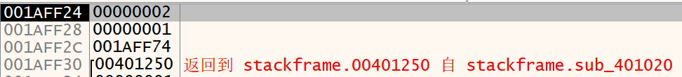

### add函数参数传递及调用

main函数中使用如下语句调用add函数,执行加法运算并输出函数返回值

```cpp
printf("%d\n", add(a, b));
```

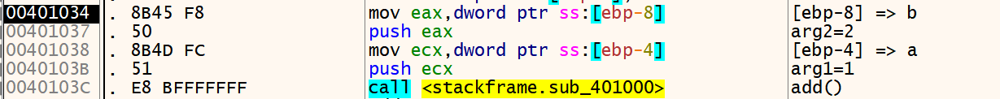g看上面 5 行汇编代码，它描述了调用 add () 函数的整个过程。

地址 40103C 处为 “Call 401000” 命令，该命令用于调用 401000 处的函数，而 401000 处的函数即为 add () 函数。

函数 add () 接收 a、b 这 2 个长整型参数，所以调用 add () 之前需要先把 2 个参数压入栈，地址 401034~40103B 之间的代码即用于此。这一过程中需要注意的是，参数入栈的顺序与 C 语言源码中的参数顺序恰好相反（我们把这称为函数参数的逆向存储）。

换言之，变量 b（[EBP-8]）首先入栈，接着变量 a（[EBP-4]）再入栈。执行完地址 401034~40103B 之间的代码后，此时函数栈如图所示

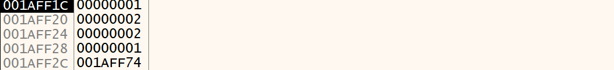

各地址的内容为

| 地址     | 内容     | 含义说明                     | 相对 EBP 偏移 |
| -------- | -------- | ---------------------------- | ------------- |
| 001AFF2C | 001AFF74 | main 保存的上层旧 EBP        | EBP+0         |
| 001AFF28 | 00000001 | main 局部变量 a              | EBP-4         |
| 001AFF24 | 00000002 | main 局部变量 b              | EBP-8         |
| 001AFF20 | 00000002 | add 第二个参数 b（后读先压） | EBP-0xC       |
| 001AFF1C | 00000001 | add 第一个参数 a（先读后压） | EBP-0x10      |

```cpp
int main(int argc, char* argv[])
{
    long a = 1, b = 2;
    printf("%d\n", add(a, b));
    return 0;
}
```

main函数的栈帧就分析到这,接着来分析add函数的栈帧

### add函数生成及栈帧

```cpp
long add(long a, long b)
{
    long x = a, y = b;
    return (x + y);
}
```

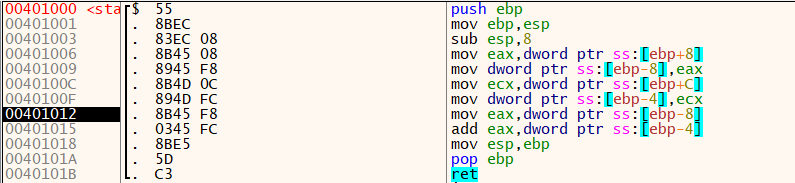

函数开始执行时，栈中会单独生成与其对应的栈帧。

```asm
00401000  PUSH EBP
00401001  MOV EBP,ESP
```

上面 2 行代码与开始执行 main () 函数时的代码完全相同，先把 EBP 值（main () 函数的基址指针）保存到栈中，再把当前 ESP 存储到 EBP 中，这样函数 add () 的栈帧就生成了。如此一来，add () 函数内部的 EBP 值始终不变。执行完以上 2 行代码后，栈内情况如图示。

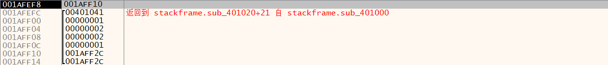

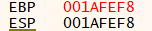

可以看到，main () 函数使用的 EBP 值（1AFF10）被备份到栈中，然后 EBP 的值被设置为新值 1AFEF8。

### 设置add函数的局部变量

```cpp
long x = a, y = b;
```

上面一行语句声明了 2 个长整型的局部变量 (x, y)，并使用 2 个形式参数 (a, b) 分别为它们赋初始值。重点关注形式参数与局部变量在函数内部的栈寻址方式。

```asm
00401003  SUB ESP,8
```

这条指令含义：在栈内存中为局部变量 x、y 开辟 8 个字节的栈空间。

```asm
00401006  MOV EAX,DWORD PTR SS:[EBP+8]  ; [EBP+8] = 形参a
00401009  MOV DWORD PTR SS:[EBP-8],EAX  ; [EBP-8] = 局部变量x
0040100C  MOV ECX,DWORD PTR SS:[EBP+C]  ; [EBP+C] = 形参b
0040100F  MOV DWORD PTR SS:[EBP-4],ECX  ; [EBP-4] = 局部变量y
```

add 函数的栈帧生成之后，EBP 基准地址固定不变：

`[EBP+8]`、`[EBP+C]` 指向传入参数 a、b；

`[EBP-8]`、`[EBP-4]` 指向 add 函数的 2 个局部变量 x、y。

此时栈内情如图所示

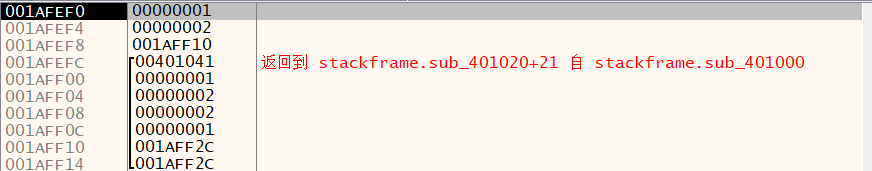

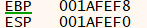

### add运算

```cpp
return (x + y);
```

此语句用于返回两个局部变量之和

```asm
00401012    MOV EAX,DWORD PTR SS:[EBP-8]  ; [EBP-8] = local x
```

上述MOV语句中，变量x的值被传送到EAX。

```asm
00401015    ADD EAX,DWORD PTR SS:[EBP-4]  ; [EBP-4] = local y
```

ADD指令为加法指令，上面这条语句中，变量y（[EBP-4]=2）与EAX原值（x）相加，且运算结果被存储在EAX中，运算完成后EAX中的值为3。

### 删除函数add的栈帧及函数执行完毕

```cpp
return (x + y);
```

同样对应如上代码

执行完加法运算后，要返回函数 add ()，在此之前先删除函数 add () 的栈帧。

```asm
00401018  MOV ESP,EBP
```

上面这条命令把当前 EBP 的值赋给 ESP，与地址 401001 处的 `MOV EBP,ESP` 命令相对应。在地址 401001 处，`MOV EBP,ESP` 命令把函数 add () 开始执行时的 ESP 值（1AFF14）放入 EBP。函数执行完毕后，使用地址 401018 处的 `MOV ESP,EBP` 命令再把 EBP 中的值恢复到 ESP 中。

**提示：**

执行完上面的命令后，地址 401003 处的 `SUB ESP,8` 命令就会失效，即函数 add () 的 2 个局部变量 x、y 不再有效。

```asm
0040101A  POP EBP
```

上面这条命令用于恢复函数 add () 开始执行时保存到栈中的 EBP 值，它与 401000 地址处的 `PUSH EBP` 命令对应。EBP 值恢复为 1AFF2C，它是 main () 函数的 EBP 值。至此，函数 add () 的栈帧就被删除了。

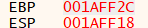

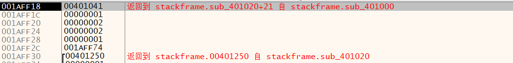

可以看到，ESP 的值为 1AFF18，该地址的值为 401041，它是执行 `CALL 401000` 命令时 CPU 存储到栈中的返回地址。

```asm
0040101B  RETN
```

执行上述 `RETN` 命令后，存储在栈中的返回地址被返回

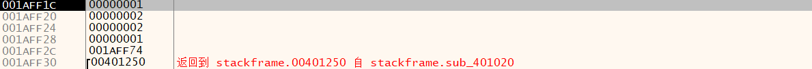

调用栈已经完全返回到调用函数 add () 之前的状态

应用程序采用上述方式管理栈，无论有多少函数被嵌套调用，栈都能得到较好的维护，不会崩溃。但由于函数的局部变量、参数、返回地址等是一次性保存到栈中的，利用字符串函数的漏洞等很容易引起栈缓冲区溢出，最终导致程序或系统崩溃。

### 从栈中删除add函数的参数

现在，程序执行流已经重新返回 main () 函数中,接下来便执行这条指令

```asm
00401041  ADD ESP,8
```

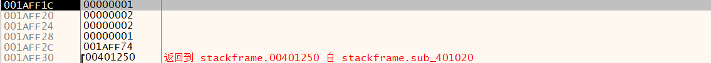

使用 ADD 命令将 ESP 加上 8，为什么突然要把 ESP 加上 8 呢？请看栈窗口，地址 1AFF1C与 1AFF20 处存储的是传递给函数 add () 的参数 a 与 b。函数 add () 执行完毕后，就不再需要参数 a 与 b 了，所以要把 ESP 加上 8，将它们从栈中清理掉（参数 a 与 b 都是长整型，各占 4 个字节，合起来共 8 个字节）。

执行完毕后,栈中参数如图

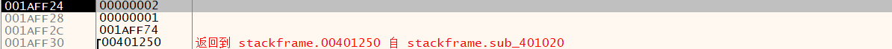

**提示**

被调函数执行完毕后，函数的调用者（Caller）负责清理存储在栈中的参数，这种方式称为 cdecl 方式；反之，被调用者（Callee）负责清理保存在栈中的参数，这种方式称为 stdcall 方式。这些函数调用规则统称为调用约定（Calling Convention），这在程序开发与分析中是一个非常重要的概念。

### 调用printf函数

```cpp
 printf("%d\n", add(a, b));
```

调用 printf () 函数的汇编代码如下所示

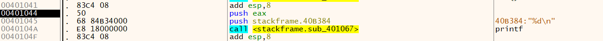

地址 401044 处的 EAX 寄存器中存储着函数 add () 的返回值，它是执行加法运算后的结果值 3。

地址 40104A 处的 CALL 401067 命令中调用的是 401067 地址处的函数，它是一个 C 标准库函数 printf ()，所有 C 标准库函数都由 Visual C++ 编写而成（其中包含着数量庞大的函数，在此不详细介绍）。

由于上面的 printf () 函数有 2 个参数，大小为 8 个字节（32 位寄存器 + 32 位常量 = 64 位 = 8 字节），所以在 40104F 地址处使用 ADD 命令，将 ESP 加上 8 个字节，把函数的参数从栈中删除。

函数 printf () 执行完毕并通过 ADD 命令删除参数后，栈内情形如图所示。

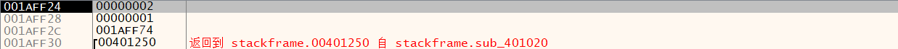

### 设置返回值

```asm
return 0;
```

main () 函数使用该语句设置返回值（0）。

```asm
00401052  XOR EAX,EAX
```

XOR 命令用来进行 Exclusive OR bit（异或）运算，其特点为 “2 个相同的值进行 XOR 运算，结果为 0”。XOR 命令比 MOV EAX,0 命令执行速度快，常用于寄存器的初始化操作。

**提示**

利用相同的值连续执行 2 次 XOR 运算即变为原值，这个特征被大量应用于编码与解码。后面的代码分析中我们会经常看到 XOR 命令。

### 删除栈帧及main函数终止

```cpp
return 0;
}
```

最终主函数终止执行，同 add () 函数一样，其返回前要先从栈中删除与其对应的栈帧。

```asm
00401054  MOV ESP,EBP
00401056  POP EBP
```

执行完上面 2 条命令后，main () 函数的栈帧即被删除，且其局部变量 a、b 也不再有效。执行至此，栈内情形如图 

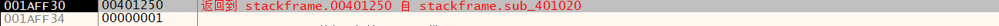

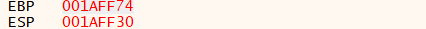

```cpp
00401057  RETN
```

执行完上面命令后，主函数执行完毕并返回，程序执行流跳转到返回地址处（401250），该地址指向 Visual C++ 的启动函数区域。随后执行进程终止代码。

## 返回地址

执行 CALL 命令进入被调用的函数之前，CPU 会先把函数的返回地址压入栈，用作函数执行完毕后的返回地址。从图中可知，在地址 40103C 处调用了 add () 函数，它的下一条命令的地址为 401041。函数 add () 执行完毕后，程序执行流应该返回到 401041 地址处，该地址即被称为 add () 函数的返回地址。

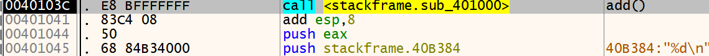

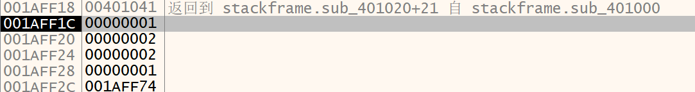

## 分析abex' crackme2

分析第二个 crackme 文件 abex’ crackme #2，它使用 Visual Basic 语言编写，你会感受到与使用 Visual C++ 或 Assembly 编写的文件相比具有不同的形态。

### 运行abex 'crackme2

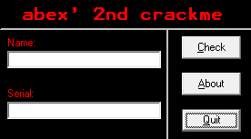

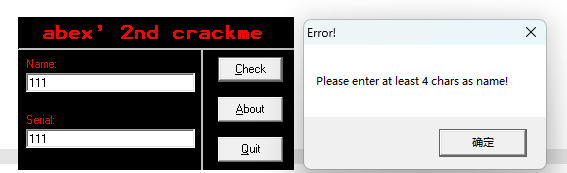

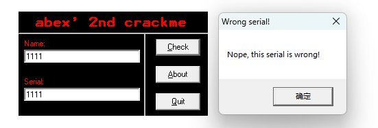

有一些特诊字符串,等下可以用字符串定位到关键函数的地址

### Visual Basic 文件的特征

VB 文件使用名为 MSVBVM60.dll（Microsoft Visual Basic Virtual Machine 6.0）的 VB 专用引擎（也称为 The Thunder Runtime Engine）。

举个使用 VB 引擎的例子，显示消息框时，VB 代码中要调用 MsgBox () 函数。其实，VB 编辑器真正调用的是 MSVBVM60.dll 里的 rtcMsgBox () 函数，在该函数内部通过调用 user32.dll 里的 MessageBoxW () 函数（Win32 API）来工作（也可以在 VB 代码中直接调用 user32.dll 里的 MessageBoxW ()）。

### 分析

运行DBG,查看 abex’ crackme #2 文件的反汇编代码

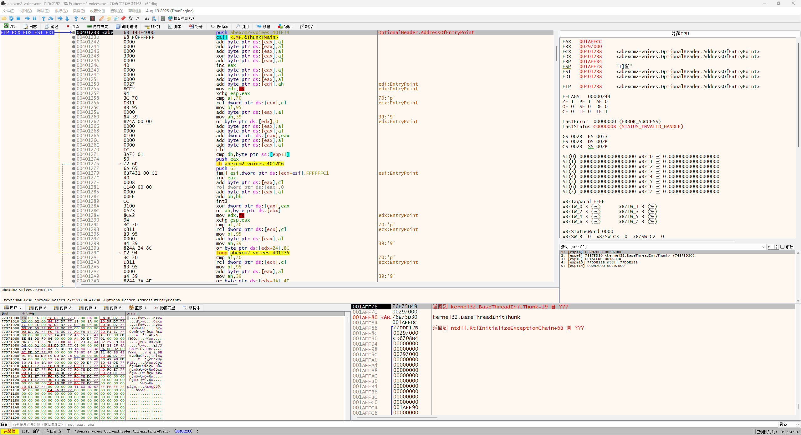

直接这样分析不是一件易事,要想一个更简单的方法才行。这种思路就是利用运行程序中的错误消息框与字符串

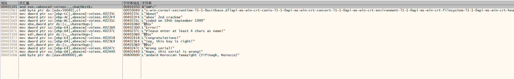

双击字符串即可跳到对应的地址,跳到00403372来

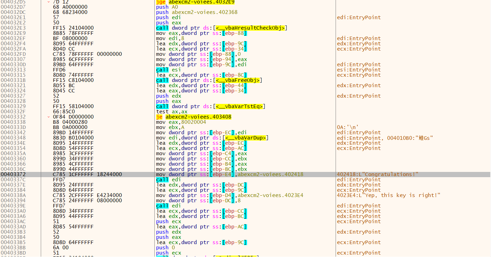

从编程的观点来看，使用某种算法生成序列号，通过比较用户输入的序列号与字符串，代码分为 TRUE（序列号相同）与 FALSE（序列号不同）两大部分。换言之，上述代码的前后存在字符串比较代码，且序列号正确时程序代码会调用消息框输出成功消息

带着怀疑向上看,果然看到了包含条件转移语句的代码

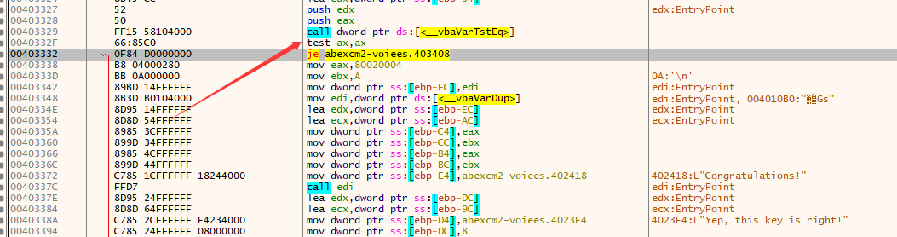

403329 地址调用了`__vbaVarTstEq()`函数，比较（TEST 命令）返回值（AX）后，由 403332 地址的条件转移指令（JE 指令）决定执行 “真” 代码还是 “假” 代码。

**提示**

- TEST    ：逻辑比较（Logical Compare）

  与按位逻辑‘AND’一样（仅改变 EFLAGS 寄存器而不改变操作数的值）

  若 2 个操作数中一个为 0，则 AND 运算结果被置为 0→ZF=1。

  

- JE       ：条件转移指令（Jump if equal）

  若 ZF=1，则跳转。


那我们先关注`__vbaVarTstEq()`函数,

-  `__vbaVarTstEq()` 是 VB 的字符串比较函数
- 上方的两个 `PUSH` 指令就是比较的两个参数
- 可以类比 C 语言的 `strcmp()` 来理解

它决定了后面是否跳转

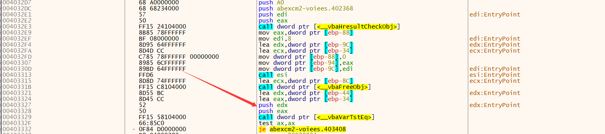

发现它被调用前,栈里压参了,应该就是`__vbaVarTstEq()`需要的参数

00403321 地址处的`SS:[EBP-44]`表达的是什么呢？“IA-32 基本说明” 与 “栈帧” 中讲过，SS 是栈段，EBP 是基址指针寄存器。换言之，`SS:[EBP-44]`指的是栈内地址，它恰好又是函数中声明的局部对象的地址（局部对象存储在栈区）。在此状态下查看栈（栈地址会随调试环境的不同而改变）。

此处下断点,运行程序

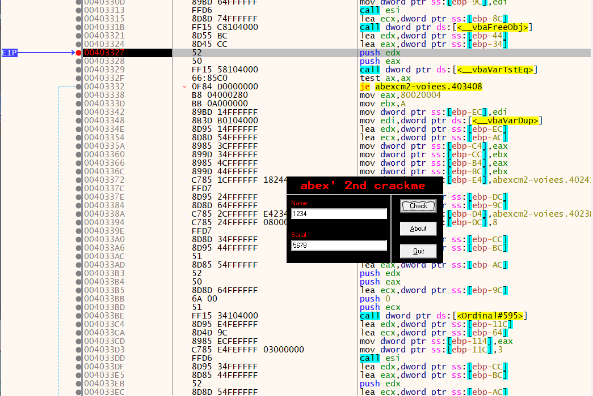

name输入1234,serial为5678

执行完两步压栈后

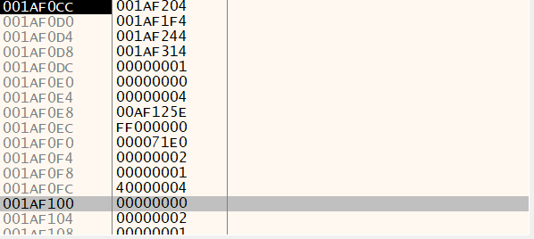

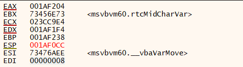

我们跟进这个地址,转到内存窗口

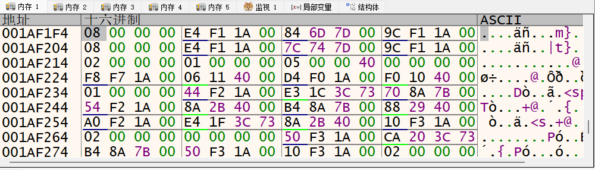

与 C++ 的 string 类一样，VB 字符串使用可变长度的字符串类型。所以就像在图中看到的一样，直接显示的不是字符串，而是 16 字节大小的数据（这就是 VB 中使用的字符串对象）。不同的值被这样统一起来，仅方框显示的值是不同的，看上去就像内存地址一样（可变长度字符串类型内部持有实际动态分配的字符串缓存地址）。

VB 字符串对象是 16 字节结构，偏移 +0 是长度，偏移 +8 是指向 Unicode 字符串数据的指针

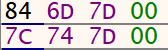

这里依旧是地址,我们接着跟进,即0x007D6D84和0x007D747C

此处是将要比对的目标序列号

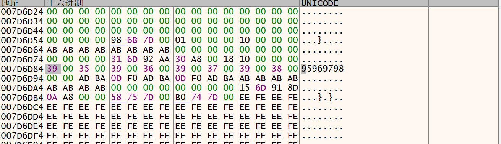

此处是我们输入的序列号

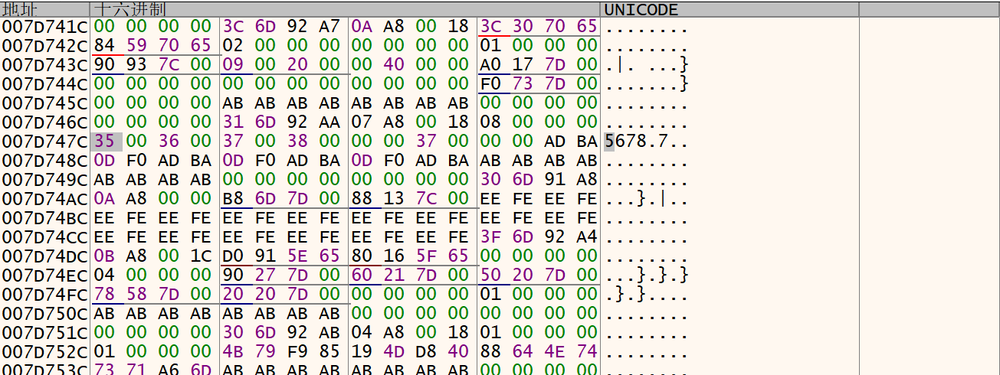

验证一下

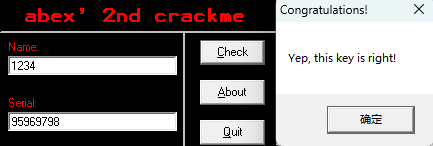
