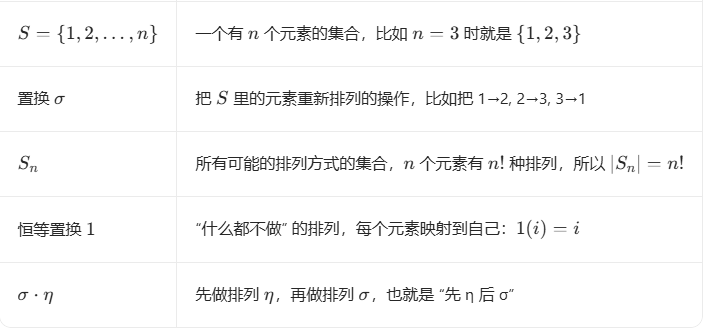

**近世代数中群、环、域的定义都是基于集合的,通过对集合上运算的约束,将集合构造成具有不同特性的新对象**

<!-- more -->

**集合:**

具有共同属性的事物的总体

**定义(集上的二元运算):**

设S为集合,映射

$$
\eta:
\begin{cases}
S \times S &\to S \\
(x, y)     &\mapsto z
\end{cases}
$$

> 我们定义了一个叫 η 的二元运算，它以集合 S 中两个元素组成的有序对 (x,y) 作为输入，最终输出集合 S 里的一个元素 z。（封闭性）

称为集合S上的二元运算

# 群

$$
设三元组 (G, \cdot, e) 中 G 为集合，\cdot 为集 G 上的二元运算，e为 G 中一个元。
$$

若（G，⋅，e）满足：
$$
G1（乘法结合律）：a \cdot (b \cdot c) = (a \cdot b) \cdot c,\ a, b, c \in G；
$$

$$
G2（单位元）：e \cdot a = a \cdot e = a,\ a \in G；
$$

$$
G3（逆元）：对 a \in G，有 a' \in G 使得 a \cdot a' = a' \cdot a = e。
$$

$$
则称 (G, \cdot, e) 为\textbf{群}，简称群 G，e 称为群 G 的\textbf{单位元}，a' 称为 a 的\textbf{逆元}。
$$

$$
若 (G, \cdot, e) 还满足 G4（交换律）：a \cdot b = b \cdot a,\ a, b \in G，则称 G 为\textbf{交换群}。
$$

$$
若 (G, \cdot, e) 仅满足 G1, G2，则称 G 为\textbf{有单位元的半群}。
$$

$$
若 (G, \cdot, e) 满足 G1, G2, G4，则称 G 为\textbf{有单位元的交换半群}。
$$

**下面举例一些群,方便我们理解**

## **eg1:**

$$
设 (\mathbb{Z}, +, 0) 中 \mathbb{Z} 为整数集，+ 为整数的加法，0 为整数零，易验证：
$$

$$
(\mathbb{Z}, +, 0) 中有 (a + b) + c = a + (b + c)，故 G1 成立
$$

$$
又有 a + 0 = 0 + a = a，故 G2 成立
$$

$$
最后有 a + (-a) = (-a) + a = 0，这里 (-a) 表示与 a 对应的负整数，因而 G3 成立
$$

$$
再 a + b = b + a，故 G4 成立
$$

$$
从而 (\mathbb{Z}, +, 0) 为交换
$$

## **eg2:**

$$
设 (Q*, ·, 1) 中 Q* 为零以外的所有有理数的集合，· 为有理数乘法，1 为整数 1，则 (Q*, ·, 1) 满足 G1, G2, G3 和 G4。故 (Q*, ·, 1) 为交换群。
$$

## **eg3:**

$$
设 GLₙ(R) 为 n 阶实数可逆方阵的集合，· 为两矩阵的乘法，I 为单位阵，则 (GLₙ(R), ·, I) 为群。GLₙ(R) 称为实数域 R 上 n 阶一般线性群。
$$
**对于实可逆矩阵:**

G1,矩阵乘法满足结合律

G2,单位矩阵 I 满足 I⋅A=A⋅I=A

G3,GLn(R) 定义的就是 “可逆矩阵” 集合 ——可逆矩阵的核心定义就是 “存在逆矩阵”，所以满足

所以说GLₙ(R) 是群

但同时它并不是交换群,因为矩阵乘法不满足交换律

## 子群

$$
设 (G, ·, 1) 为群，A 为 G 的子集合。若单位元 1 ∈ A 且 (A, ·, 1) 构成群，则称 A 为 G 的子群，并记为 A ≤ G。
$$

例

$$
证明 nℤ = [{0, ±n, ±2n, …}] 为整数群 (ℤ, +, 0) 的子群
$$

证

$$
nℤ ⊆ ℤ；
 0 ∈ nℤ；
 (nℤ, +, 0) 为群。
$$

## 循环群

$$
若群 G 的每一个元都能表成一个元素 a 的幂，则 G 称为由 a 生成的循环群，记作 G = ⟨a⟩，a 称为循环群 G 的生成元。
$$

**根据元素的阶的性质，循环群 G = ⟨a⟩ 共有两种类型：**

$$
1.  当生成元 a 是无限阶元素时，则 G 称为无限阶循环群。\\
$$

$$
2.  如果 a 的阶为 n，即 aⁿ = 1，那么这时
    G = ⟨a⟩ = ⟨1, a, a², …, aⁿ⁻¹⟩\\
    则 G 称为由 a 所生成的n 阶循环群。(注意此时 1, a, a², …, aⁿ⁻¹ 两两不同)
$$

### 元素的阶

设 G 是一个群，a∈G，元素 a 的阶定义为：

> 
> $$
> 若存在最小的正整数n，使得a^n=e（e 是群的单位元），则称 a 的阶为 n，记作 ord(a)=n\\
> 
> 若不存在这样的正整数 n，则称 a 是无限阶元素，记作 ord(a)=∞
> $$

简单理解就是：

阶就是 “把这个元素自己乘自己多少次，能变回单位元” 的最小次数，而无限阶意味着无论乘多少次，都回不到单位元

**在整数加法群 (Z,+,0) 中：**

单位元 0 的阶是 1，因为 1⋅0=0（加法下的 “幂” 就是倍数）

非零整数 a≠0 的阶都是无限的，因为 na=0 只有当 n=0 时成立，没有正整数解

### 群的阶

群 G 的阶，就是这个群里**元素的个数**，记作 ∣G∣

> 若 G 有有限个元素，称为**有限群**，∣G∣ 是一个正整数
>
> 若 G 有无限个元素，称为**无限群**，∣G∣=∞

**例子：**

- 整数加法群 (Z,+,0) 是无限群，∣Z∣=∞。
- 模 n 加法群 Zn 是有限群，∣Zn∣=n。

## 对称群

### 置换

$$
设 S = {1, 2, …, n}，若映射 σ: S → S 是可逆的，则称 σ 为 S 上的置换
$$

### 定义（对称群）

全体 S 上的置换所成的集合记为 Sₙ，令 1 表示恒等置换（即对任意 i ∈ S，有 1(i) = i）
$$
在 Sₙ 中以 σ(i) 表示 i 在置换 σ 下的像，定义 Sₙ 中两元素 σ 与 η 的乘积为：
$$

$$
[σ · η](i) = σ(η(i))
$$

$$
则 (Sₙ, ·, 1) 成群，群 Sₙ 称为n 次对称群
$$

### 举例

取 n=3，定义两个置换：
$$
\sigma = \begin{pmatrix}1 & 2 & 3 \\ 2 & 3 & 1\end{pmatrix}, \quad \eta = \begin{pmatrix}1 & 2 & 3 \\ 3 & 1 & 2\end{pmatrix}
\
$$
即 σ(1)=2, σ(2)=3, σ(3)=1，η(1)=3, η(2)=1, η(3)=2

计算σ⋅η：
$$
\begin{align*}
[\sigma \cdot \eta](1) &= \sigma(\eta(1)) = \sigma(3) = 1; \\
[\sigma \cdot \eta](2) &= \sigma(\eta(2)) = \sigma(1) = 2; \\
[\sigma \cdot \eta](3) &= \sigma(\eta(3)) = \sigma(2) = 3.
\end{align*}
$$
所以 σ⋅η 就是恒等置换 1，这说明 σ 和 η 互为逆元

### 置换密码

置换密码，也叫**换位密码**，是一种经典的加密技术。它的核心思想是：**不改变明文中的字符本身，只改变它们的排列顺序**，从而隐藏信息

#### 原理

**本质**：加密过程就是对明文序列执行一个**置换操作** σ，解密则是执行其逆置换 

**与对称群的关系**：所有可能的置换操作构成了一个**对称群** Sn。密钥就是这个群中的一个特定元素（置换规则），解密则需要找到它的逆元

## 离散对数问题

不同代数系统中都有各自的对数（离散对数）问题，有的可以找到快速算法，有的则尚未找到快速算法。尚未找到快速算法的离散对数问题，可以看作一个数学上的“难题”，能够用来构造密码学算法或协议。

在群 G 里，我们先定义 “幂”：
$$
若群运算为乘法（如模乘群 Z_n^*，n 为素数）,那 a^m 就是把 a 自己乘 m 次
$$

$$
  a^m = \underbrace{a \otimes_n a \otimes_n \cdots \otimes_n a}_{m \text{ 个 } a} \quad (m \text{ 为整数})
$$

$$
若群运算为加法：那 x⋅a 就是把 a 自己加 x 次
$$

$$
  x \cdot a = \underbrace{a + a + \cdots + a}_{x \text{ 个 } a} \quad (x \text{ 为整数})
$$

**离散对数问题**就是：

已知 a 和 b，求整数 x，使得：

- 乘法群：a^x=b
- 加法群：x⋅a=b

#### Diffie-Hellman密钥交换

公开：大素数 p、生成元 g

$$
Alice 选 a，发 A=g^amodp
$$

$$
Bob 选 b，发 B=g^bmodp
$$

$$
共享密钥：K=B^a=(g^b)^a=g^{ab}=A^b
$$

攻击者只看到 g,A,B，要算 ab 就必须解离散对数，而这在大素数下几乎不可能

# 环

$$
设五元组 (R, +, ·, 0, 1) 中，R 为集合，+ 与 · 为集 R 上二元运算，0 与 1 为 R 中元。若 (R, +, ·, 0, 1) 满足：
$$

$$
R1（加法交换群）：(R, +, 0) 是交换群；
$$

$$
R2（乘法半群）：(R, ·, 1) 是有单位元的半群；
$$

$$
R3（乘法对加法的分配律）：
  a · (b + c) = a · b + a · c，(b + c) · a = b · a + c · a，对任意 a,b,c ∈ R
$$

$$
则称 (R, +, \cdot, 0, 1) 为环，简称环 R
$$

 **若还满足**
$$
R4 (乘法半群交换)：(R,・, 1) 为交换半群。则称 R 为交换环
$$

$$
+与·称为环R的加法与乘法
$$

$$
0称为环的零元
$$

$$
1称为环的单位元（环不一定有单位元,含幺环一定有单位元）
$$

$$
若a'' ∈ R使a'' · a = 1，则称a''为a的逆元，写为a⁻¹
$$

$$
若a' ∈ R使a' + a = 0，则称a'为a的负元，写为-a；
$$

$$
(R, +, 0)称为环R的加法群
$$

$$
(R, ·, 1)称为环R的乘法半群
$$

## 体

若环 (R, +,・, 0, 1) 满足

$$
R5：(R^*,・, 1) 为群，这里 R^* = R − {0}，则称 R 为体
$$

> 说明：很多教材里“体”与“域”在中文语境下常常混用；在这里我们按“域”来理解最常见的交换情形。

## 域

若环 (R, +,・, 0, 1) 满足

$$
R6：(R^*,・, 1) 为交换群，则称 R 为域
$$

$$
也就是说，域就是“乘法可交换的体”：除了 0 之外，每个元素都可逆，而且乘法满足交换律。
$$

$$
在域中，非零元素都能做除法，因此可以在域上进行完整的多项式运算、线性方程组运算等。
$$

**看起来环的定义好像很复杂,但我们简单记住环 = 加法交换群 + 乘法半群 + 分配律即可**

**下面举例一些环,方便我们理解**

## eg1:

$$
整数集 Z 在整数 + 与整数・下为交换环，称为整数环 (Z,+,・,0,1)，简记为环
$$

满足

- (Z,+,0) 是交换群
- (Z,・,1) 是有单位元的交换半群
- 乘法对加法的分配律 :a・(b+c)=a・b+a・c，(b+c)・a=b・a+c・a

## eg2:

$$
有理数集 Q 在有理数加法 + 与有理数乘法・下为域，称为有理数域 (Q,+,・,0,1)，简记为域 Q
$$

 满足

- (Q,+,0) 是交换群

- (Q,・,1) 是有单位元的半群

- 乘法对加法的分配律：a・(b+c)=a・b+a・c，(b+c)・a=b・a+c・a

  这里已经能证明了是环了,但还满足
  $$
  (Q^*,・, 1) 为交换群
  $$

所以称为有理数域 (Q,+,・,0,1)

## 零因子

$$
设 a,b ∈ R，且 a ≠ 0,b ≠ 0，若 a・b = 0，则称 a 与 b 为环 R 中的零因子
$$

$$
在环 Z₂₆中 13 和 2 是零因子
$$

## 整环

环 R 若无零因子，则称 R 为无零因子环。交换的无零因子环称为整环

## 理想

$$
若 I 为环 R 的加法群的子群，且对任 a ∈ I 和任 r ∈ R 有 ar ∈ I 和 ra ∈ I，则称 I 为环 R 的理想
$$

## 主理想

$$
若 I 为交换环 R 的理想。若 I = \{ra | r ∈ R\}，则称 I 为环 R 的主理想，并记为 I = (a)
$$

$$
在整数环 (Z,+,・,0,1) 中，令 nZ = {0, ±n, ±2n, …}，则 nZ 为环 Z 的理想，且 nZ 为环 Z 的主理想，此时 nZ = (n)。
$$

## 环上的多项式

$$
设 x 为文字，R 为交换环，x ∉ R。定义 R 上多项式集
$$

$$
R[x] = \left\{ f(x) = \sum_{i=0}^{n} a_i x^i \mid n \in \mathbb{Z}_{\ge 0},\ a_i \in R \right\}
$$

$$
1. f(x) = \sum_{i=0}^{n} a_i x^i 称为交换环 R 上关于文字 x 的多项式
$$

$$
2. a_i x^i 称为 f(x) 的第 i 次项，a_i 为 f(x) 的第 i 次项系数；其中 a_0 x^0 约定简写为 a_0
$$

$$
3. 当 a_n \neq 0 时，a_n x^n 称为 f(x) 的首项，a_n 称为首项系数，n 称为 f(x) 的次数，记作 \deg f(x)=n；特别地，当 a_n=1 时，称 f(x) 为首一多项式
$$

$$
4. 称 0 \in R[x] 为零多项式，并约定 \deg(0)=-\infty，且对任意非负整数 n，有 n+(-\infty)=-\infty
$$

$$
5. 若 f(x)=\sum_{i=0}^{n} a_i x^i，g(x)=\sum_{i=0}^{m} b_i x^i，则规定
$$

$$
f(x)+g(x)=\sum_{i=0}^{\max(n,m)} (a_i+b_i)x^i
$$

$$
其中不足的系数按 0 补齐；乘法定义为
$$

$$
f(x)g(x)=\sum_{k=0}^{n+m} c_k x^k,\quad c_k=\sum_{i+j=k} a_i b_j
$$

$$
这就是多项式的普通加法与卷积乘法。因为 R 是交换环，所以 R[x] 仍是交换环，并且若 R 有单位元 1，则 R[x] 的单位元也是常数多项式 1
$$

$$
6. 若 f(x),g(x)\in R[x] 且 g(x)\neq 0，存在 q(x),r(x)\in R[x] 使得 f(x)=q(x)g(x)+r(x)，且 \deg r(x)<\deg g(x)，则称 q(x) 为商式，r(x) 为余式
$$

$$
在域上，多项式除法总是成立；但在一般交换环上，除法未必总能进行
$$

$$
7. 若存在 h(x)\in R[x] 使 f(x)=g(x)h(x)，则称 g(x) 整除 f(x)，记作 g(x)\mid f(x)
$$

$$
8. 若 f(x) 在 R[x] 中不能分解为两个次数都大于 0 的多项式之积，则称 f(x) 为不可约多项式
$$

$$
9. 当 R 是域时，R[x] 的结构最完整：可做加法、乘法、除法余式运算，也可以讨论最大公因式、因式分解、不可约多项式等概念
$$

